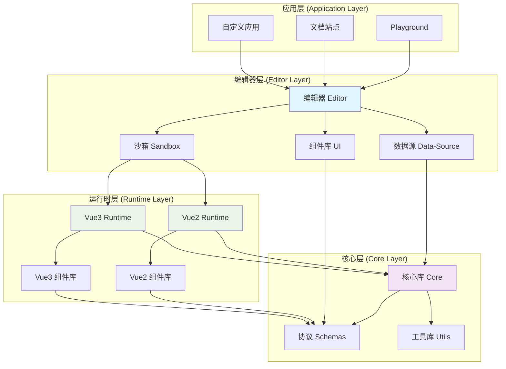
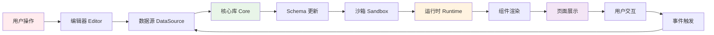

# Quantum 低代码平台

<div align="center">
  
  
  <h1>Quantum 低代码平台</h1>
  
  <p>一个现代化的、可扩展的、跨框架的低代码可视化搭建平台</p>

  [](https://github.com/little-littleprogrammer/quantum-lowcode/actions)
  [](LICENSE)
  [](https://nodejs.org)
  [](https://pnpm.io)
</div>

## 📖 概览

### 🚀 在线体验

- **[📚 文档站点](https://little-littleprogrammer.github.io/quantum-lowcode/docs/)** - 完整的开发文档和API参考
- **[🎯 演示项目](https://little-littleprogrammer.github.io/quantum-lowcode/playground/)** - 在线体验编辑器功能

### 🎯 项目目标

构建一个基础的、可扩展的、可被二次封装的、不依赖于特定框架的低代码平台，让开发者能够快速搭建可视化应用。

## ✨ 核心特性

### 🔧 技术特性
- **🎨 可视化编辑器**：所见即所得的拖拽式编辑体验
- **📱 跨平台支持**：同时支持PC端和移动端H5应用开发
- **🔄 跨框架兼容**：支持Vue2、Vue3等多种前端框架
- **🎯 实时预览**：编辑过程中实时查看效果，无需等待编译
- **📦 组件化架构**：完全组件化的设计，易于扩展和维护

### 🚀 开发特性
- **🔌 插件系统**：强大的插件机制，支持自定义扩展
- **🎭 沙箱隔离**：基于iframe的沙箱环境，确保编辑器稳定性
- **📊 数据驱动**：完整的数据源管理和双向绑定机制
- **🎪 事件系统**：灵活的事件配置和处理机制
- **📋 Schema标准**：标准化的JSON Schema配置协议

### 🛠️ 工程特性
- **📦 Monorepo架构**：使用pnpm workspace管理多包项目
- **⚡ 现代构建工具**：基于Vite的快速构建和开发体验
- **🔍 TypeScript支持**：完整的类型定义和检查
- **🎨 代码规范**：统一的ESLint和Prettier配置

## 🏗️ 项目架构

### 整体架构图



### 数据流向图



## 🛠️ 技术栈

### 前端技术栈
- **框架**：Vue 3.x + TypeScript
- **构建工具**：Vite + Rollup
- **状态管理**：Pinia
- **UI框架**：Ant Design Vue
- **代码编辑器**：Monaco Editor
- **图表库**：ECharts
- **拖拽库**：Moveable
- **样式处理**：Sass/Less

### 工程化工具
- **包管理**：pnpm (Monorepo)
- **构建优化**：Turbo
- **代码规范**：ESLint + Prettier
- **类型检查**：TypeScript
- **版本管理**：Changesets
- **提交规范**：Conventional Commits

## 📦 模块介绍

### 核心模块

#### 1. 📚 Core（核心库）
```typescript
// 数据模型(schemas)定义、存储与处理、以及事件状态的存储
import { LowCodeRoot, LowCodePage, LowCodeNode } from '@quantum-lowcode/core';
```

**主要功能**：
- **Node节点类**：定义组件与容器节点，关联父节点、页面节点、根节点
- **Page页面类**：定义页面节点，可根据field获取Node节点信息
- **Root根节点类**：定义根节点，提供注册与注销全局组件方法
- **事件与全局状态管理**：统一的事件系统和状态管理

#### 2. 🎨 Editor（编辑器）
```typescript
// 可视化编辑器模块，包括画布、布局、服务
import { Editor } from '@quantum-lowcode/editor';
```

**主要功能**：
- **布局组件**：Framework（布局）、Workspace（工作区）、Sandbox（画布）
- **Service Store**：全局状态管理
  - EditorService：关联core模块，实现节点的设置读取更新
  - UiService：画布功能的样式管理
  - DataSourceService：数据源管理
- **Hooks**：Use-service等钩子函数

#### 3. 📱 Sandbox（沙箱）
```typescript
// 画布功能，负责编辑器与运行时通信
import { BoxCore } from '@quantum-lowcode/sandbox';
```

**主要功能**：
- **BoxCore**：负责统一对外接口，管理BoxRender、BoxMask、ActionManager
- **BoxRender**：基于iframe加载runtime，支持组件增删改查
- **BoxMask**：蒙层，隔绝鼠标事件，避免组件事件被触发
- **ActionManager**：监听鼠标键盘事件，实现单选、多选、高亮行为

#### 4. 📊 Data-Source（数据源）
```typescript
// 全局数据源和方法管理
import { DataSourceManager } from '@quantum-lowcode/data-source';
```

**主要功能**：
- 支持base和http两种数据源类型
- 数据绑定和依赖管理
- 全局方法调用

#### 5. 🎭 Runtime（运行时）
```typescript
// 运行时渲染，与低代码引擎完全脱离
import Vue2Runtime from '@quantum-lowcode/runtime-vue2-active';
import Vue3Runtime from '@quantum-lowcode/runtime-vue3';
```

**主要功能**：
- 通过sandbox画布传递schemas
- 支持Vue2和Vue3两种运行时
- 可视化页面所见即所得渲染

#### 6. 🧩 UI组件库
```typescript
// Vue组件库
import { QButton, QContainer, QText } from '@quantum-lowcode/ui'; // Vue3
import { QButton, QContainer, QText } from '@quantum-lowcode/ui-vue2'; // Vue2
```

**主要功能**：
- **UI**：Vue3组件库，提供基础组件
- **UI-Vue2**：Vue2组件库，支持Vue2项目
- 跨框架组件支持

## 🚀 快速开始

### 环境要求

- **Node.js**: >= 18.18.2
- **pnpm**: >= 9.15.7
- **Git**: >= 2.0.0

### 安装步骤

```bash
# 1. 克隆项目
git clone https://github.com/little-littleprogrammer/quantum-lowcode.git
cd quantum-lowcode

# 2. 安装依赖
pnpm install

# 3. 启动开发环境
pnpm playground
```

### 开发命令

```bash
# 安装所有依赖
pnpm install

# 构建所有包
pnpm build

# 启动开发模式
pnpm dev

# 启动playground演示
pnpm playground

# 代码格式化
pnpm format

# 代码检查
pnpm lint

# 生成changelog
pnpm changelog
```

## 📚 使用指南

### 基本使用流程

1. **📦 开发物料组件**：开发业务组件（如图片组件、抽奖组件等），并配置为runtime的依赖
2. **⚙️ Schema配置**：根据自定义的Schema协议，编写配置化的JSON，期间可实时预览
3. **👀 预览与保存**：点击预览查看最终效果，点击保存将配置文件上传至服务器

### Schema标准示例

```javascript
// Schema最终协议，低代码协议标准
{
    type: 'root', // root | page | container
    children: [{
        type: 'page', // 支持多页面应用
        field: 'page1',
        children: [{
            type: 'container',
            field: 'container1', // 唯一key，映射为HTML element的id
            style: {
                backgroundColor: '#f0f0f0',
                padding: '20px'
            },
            children: [{
                field: 'button1',
                component: 'q-button',
                componentProps: {
                    text: '点击我',
                    type: 'primary'
                },
                events: {
                    click: 'handleButtonClick'
                }
            }]
        }, {
            field: 'slide',
            component: 'q-carousel',
            style: {
                backgroundImage: 'url(https://cdn.example.com/bg.jpg)'
            },
            componentProps: {
                autoplay: true,
                interval: 3000
            }
        }]
    }]
}
```

### 组件开发示例

```vue
<!-- 自定义组件示例 -->
<template>
  <div class="q-custom-component">
    <h3>{{ title }}</h3>
    <p>{{ content }}</p>
    <button @click="handleClick">{{ buttonText }}</button>
  </div>
</template>

<script setup lang="ts">
import { defineProps, defineEmits } from 'vue';

// 定义组件属性
const props = defineProps<{
  title: string;
  content: string;
  buttonText: string;
}>();

// 定义事件
const emit = defineEmits<{
  click: [event: MouseEvent];
}>();

const handleClick = (event: MouseEvent) => {
  emit('click', event);
};
</script>
```

```typescript
// 组件配置示例
export default [{
    field: 'api',
    label: '请求接口',
    component: 'InputSelect',
}, {
    // 此组件支持的事件, 需要在组件中emit出来,目的为配置化界面配置事件时可以选择一下事件
    field: 'events',
    label: '事件',
    component: 'EventSelect', // 事件必须填这个组件
    componentProps: {
        options: [{
            label: '点击',
            value: 'onClick',
        }, {
            label: 'change',
            value: 'onChange',
        }],
    },
}]; 

```

## 📖 API文档

### 核心API

#### LowCodeRoot
```typescript
class LowCodeRoot {
  constructor(options: ILowCodeRootOptions)
  
  // 设置配置
  setConfig(config: ILowCodeRootConfig, pageId?: string): void
  
  // 切换页面
  setPage(pageId: string): void
  
  // 注册组件
  registerComponent(name: string, component: any): void
  
  // 注册事件
  registerEvent(name: string, handler: Function): void
}
```

#### BoxCore (沙箱核心)
```typescript
class BoxCore {
  constructor(options: IBoxCoreConfig)
  
  // 设置运行时
  setRuntime(runtime: IRuntime): Promise<void>
  
  // 更新组件
  updateNode(data: IUpdateData): void
  
  // 删除组件
  removeNode(data: IRemoveEventData): void
  
  // 选中组件
  selectNode(id: string): void
}
```

更多API文档请参考：[详细API文档](apps/quantum-docs/docs/api/schema/index.md)

## 🔧 开发指南

### 组件开发

详细的组件开发指南请参考：[组件开发目录](packages/ui-vue2)

**开发步骤**：

1. **创建组件目录**：在 `packages/ui/src/` 或 `packages/ui-vue2/src/` 下创建组件文件夹
2. **实现组件逻辑**：编写 `.vue` 组件文件
3. **配置表单Schema**：在 `formSchema.ts` 中定义组件属性配置
4. **注册组件**：在 `index.ts` 中导出组件
5. **测试组件**：在playground中测试组件功能

### 调试组件

可以直接通过页面编辑器进行组件调试和配置。

### 二次开发

如需进行二次开发，请参考：[二次开发指南](apps/quantum-docs/docs/help-code/upgrade/sec.md)

## 🚧 开发路线图

### ✅ 已完成功能
- [x] 基础架构搭建
- [x] 核心库(Core)开发
- [x] 沙箱画布(Sandbox)开发  
- [x] 基础编辑器功能
- [x] 基础组件库
- [x] 数据源管理
- [x] Schema协议定义
- [x] 模板库
- [x] 样式编辑器

### 🚧 正在开发
- [ ] 事件配置系统增强
- [ ] 组件树管理
- [ ] 历史记录/撤销重做
- [ ] 拖拽功能增强
- [ ] 容器组件完善

### 📋 规划中
- [ ] 插件系统
- [ ] 自定义组件市场
- [ ] 团队协作功能
- [ ] 版本管理
- [ ] 权限管理
- [ ] CLI工具完善
- [ ] 更多运行时支持(React, Angular)
- [ ] 移动端适配优化
- [ ] 性能监控
- [ ] GPT集成，通过prompt生成schemas

## 🎯 最终目标

1. **🚀 跨框架引擎**：不依赖于特定框架的低代码引擎，支持所有主流前端框架
2. **📦 NPM包分发**：可供外部二次封装，核心能力通过NPM包分发
3. **🌐 全场景支持**：支持前台、后台、H5项目的开发
4. **🤖 AI集成**：接入GPT，通过prompt方式生成schemas配置

## 🤝 贡献指南

我们欢迎所有形式的贡献！请参考以下指南：

### 贡献方式
- 🐛 提交Bug报告
- 💡 提出新功能建议
- 📖 改进文档
- 🔧 提交代码修复
- 🧪 编写测试用例

### 开发流程
1. Fork本仓库
2. 创建功能分支 (`git checkout -b feature/AmazingFeature`)
3. 提交更改 (`git commit -m 'Add some AmazingFeature'`)
4. 推送到分支 (`git push origin feature/AmazingFeature`)
5. 创建Pull Request

### 代码规范
- 使用TypeScript编写代码
- 遵循ESLint和Prettier配置
- 编写单元测试
- 提交信息遵循Conventional Commits规范

## 📄 许可证

本项目采用 [MIT](LICENSE) 许可证。

## 🙏 致谢

感谢所有为这个项目做出贡献的开发者和社区成员！

## 📞 支持与反馈

- 📧 邮箱：[your-email@example.com]
- 🐛 问题反馈：[GitHub Issues](https://github.com/little-littleprogrammer/quantum-lowcode/issues)
- 💬 讨论：[GitHub Discussions](https://github.com/little-littleprogrammer/quantum-lowcode/discussions)

---

<div align="center">
  <p>如果这个项目对你有帮助，请给我们一个⭐️</p>
  <p>Made with ❤️ by Quantum Team</p>
</div>
