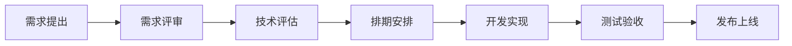

# 项目管理

## 项目概览

Quantum低代码平台是一个面向企业级应用的可视化搭建平台，旨在通过拖拽式组件编排和配置化开发，提升前端开发效率。

### 技术栈

**前端技术栈:**
- Vue 3.x + TypeScript
- Vite 构建工具
- Pinia 状态管理
- Ant Design Vue 组件库
- Monaco Editor 代码编辑器
- ECharts 图表库

**后端技术栈:**
- Node.js + Express
- TypeScript
- MongoDB / MySQL
- Redis 缓存
- Docker 容器化

**工程化工具:**
- pnpm Monorepo 管理
- Turbo 构建优化
- ESLint + Prettier 代码规范
- Vitest 单元测试
- Playwright E2E测试
- Changeset 版本管理

## 项目规划

### 开发阶段

#### Phase 1: 核心功能开发 (已完成)
- [x] 基础架构搭建
- [x] 核心库(Core)开发
- [x] 沙箱画布(Sandbox)开发  
- [x] 基础编辑器功能
- [x] 基础组件库
- [x] 数据源管理
- [x] Schema协议定义

#### Phase 2: 编辑器增强 (进行中)
- [x] 可视化编辑器UI优化
- [x] 拖拽交互增强
- [x] 属性配置面板
- [ ] 样式编辑器
- [ ] 事件配置系统
- [ ] 组件树管理
- [ ] 历史记录/撤销重做

#### Phase 3: 高级功能 (规划中)
- [ ] 插件系统
- [ ] 自定义组件市场
- [ ] 模板库
- [ ] 团队协作功能
- [ ] 版本管理
- [ ] 权限管理

#### Phase 4: 生态建设 (规划中)
- [ ] CLI工具完善
- [ ] VSCode插件
- [ ] 更多运行时支持(React, Angular)
- [ ] 移动端适配
- [ ] 性能监控
- [ ] 文档站点完善

### 里程碑

| 版本 | 时间 | 主要功能 | 状态 |
|------|------|----------|------|
| v0.1.0 | 2024-01 | 基础架构 | ✅ 完成 |
| v0.2.0 | 2024-02 | 核心编辑器 | ✅ 完成 |
| v0.3.0 | 2024-03 | 组件系统 | ✅ 完成 |
| v1.0.0 | 2024-06 | 功能完整版 | 🚧 开发中 |
| v1.1.0 | 2024-08 | 插件系统 | 📋 规划中 |
| v2.0.0 | 2024-12 | 生态完善 | 📋 规划中 |

## 团队组织

### 开发团队

**核心团队:**
- 架构师 x1: 负责整体架构设计和技术决策
- 前端负责人 x1: 负责前端技术栈和开发规范
- 后端负责人 x1: 负责后端服务和数据管理
- 高级开发工程师 x3: 负责核心功能开发
- 前端开发工程师 x2: 负责组件和编辑器开发
- 测试工程师 x1: 负责质量保证和自动化测试

**协作团队:**
- 产品经理 x1: 需求管理和产品规划
- UI/UX设计师 x1: 界面设计和用户体验
- 技术文档工程师 x1: 文档编写和维护
- DevOps工程师 x1: 持续集成和部署

### 职责分工

#### 模块负责人
- **Core模块**: 张三 (@zhangsan)
- **Editor模块**: 李四 (@lisi)  
- **Sandbox模块**: 王五 (@wangwu)
- **UI组件库**: 赵六 (@zhaoliu)
- **数据源管理**: 钱七 (@qianqi)
- **文档站点**: 孙八 (@sunba)

#### 跨团队协作
- **需求评审**: 产品经理主导，技术团队参与
- **技术评审**: 架构师主导，相关开发人员参与
- **代码评审**: 两人review制度
- **测试验收**: 测试工程师负责，开发人员配合

## 工作流程

### 需求管理

#### 需求收集
1. **用户反馈**: 通过GitHub Issues收集
2. **产品规划**: 产品经理主导的需求分析
3. **技术债务**: 开发团队识别的技术改进点
4. **竞品分析**: 定期的竞品功能对比

#### 需求优先级
- **P0 - 紧急**: 严重bug修复，线上问题
- **P1 - 高优先级**: 核心功能开发，重要特性
- **P2 - 中优先级**: 功能增强，用户体验优化
- **P3 - 低优先级**: 技术债务，性能优化

#### 需求流程


### 开发流程

#### Sprint规划
- **Sprint周期**: 2周
- **Planning会议**: Sprint开始时进行
- **Daily Standup**: 每日晨会同步进展
- **Review会议**: Sprint结束时展示成果
- **Retrospective**: Sprint回顾和改进

#### 开发规范
1. **分支管理**: GitFlow工作流
2. **提交规范**: Conventional Commits
3. **代码审查**: 至少一人review
4. **测试要求**: 单元测试覆盖率80%+
5. **文档更新**: API变更需同步更新文档

#### 发布流程
1. **功能开发**: feature分支开发
2. **集成测试**: 合并到develop分支
3. **预发布**: release分支预发布测试
4. **正式发布**: 合并到main分支并打tag
5. **热修复**: hotfix分支快速修复

### 质量保证

#### 代码质量
- **静态检查**: ESLint + TypeScript检查
- **代码格式**: Prettier自动格式化
- **复杂度控制**: 函数圈复杂度<=10
- **重复代码**: 避免重复代码，提取公共逻辑

#### 测试策略
- **单元测试**: 核心逻辑100%覆盖
- **集成测试**: 模块间交互测试
- **E2E测试**: 关键用户路径测试
- **性能测试**: 关键功能性能基准测试
- **安全测试**: 定期安全扫描

#### 质量门禁
```yaml
# 合并到main分支的条件
quality_gates:
  - code_coverage: ">= 80%"
  - test_pass_rate: "100%"
  - code_review: "approved"
  - security_scan: "passed"
  - performance_test: "passed"
```

## 项目监控

### 开发指标

#### 代码指标
- **提交频率**: 每天平均提交次数
- **代码行数**: 新增/修改/删除代码行数
- **测试覆盖率**: 单元测试覆盖率变化
- **Bug密度**: 每千行代码Bug数量
- **技术债务**: SonarQube技术债务指标

#### 团队指标  
- **开发效率**: Story Points完成速度
- **缺陷率**: 发布后发现的Bug数量
- **代码质量**: Code Review发现问题数量
- **文档覆盖**: API文档覆盖率

### 产品指标

#### 使用数据
- **用户访问**: 日活跃用户数(DAU)
- **功能使用**: 各功能模块使用频率
- **页面性能**: 首屏加载时间、交互响应时间
- **错误率**: 前端错误率、接口错误率

#### 业务指标
- **用户满意度**: 用户反馈评分
- **功能采用率**: 新功能的使用率
- **留存率**: 用户留存情况
- **转化率**: 试用到正式使用的转化率

### 监控工具

#### 开发监控
- **GitHub**: 代码管理和Issue跟踪
- **SonarQube**: 代码质量分析
- **Jira**: 项目管理和需求跟踪
- **Confluence**: 文档和知识管理

#### 运行监控
- **Sentry**: 错误监控和性能追踪
- **Google Analytics**: 用户行为分析
- **New Relic**: 应用性能监控
- **Grafana**: 系统监控大屏

## 风险管理

### 技术风险

#### 架构风险
- **风险**: 技术架构无法支撑业务增长
- **缓解**: 定期架构评审，及时重构优化
- **应急**: 分阶段迁移方案

#### 依赖风险
- **风险**: 关键依赖库不再维护或有安全漏洞
- **缓解**: 定期依赖更新，安全扫描
- **应急**: 依赖替换方案

#### 性能风险
- **风险**: 大型项目编辑器性能下降
- **缓解**: 性能基准测试，虚拟化优化
- **应急**: 降级方案和性能优化

### 人员风险

#### 关键人员流失
- **风险**: 核心开发人员离职
- **缓解**: 知识文档化，代码review制度
- **应急**: 人员备份和快速招聘

#### 技能储备不足
- **风险**: 团队技能无法满足新需求
- **缓解**: 定期技术培训，知识分享
- **应急**: 外部技术支持

### 业务风险

#### 需求变更
- **风险**: 频繁的需求变更影响开发进度
- **缓解**: 需求变更评估流程
- **应急**: 敏捷调整和优先级管理

#### 竞争压力
- **风险**: 竞品功能领先或市场变化
- **缓解**: 定期竞品分析，差异化定位
- **应急**: 快速响应和功能迭代

## 沟通协作

### 会议制度

#### 定期会议
- **周会**: 每周团队同步会议
- **月会**: 每月项目进展汇报
- **季度会**: 季度OKR回顾和规划
- **年会**: 年度总结和规划大会

#### 临时会议
- **需求评审**: 新需求讨论会议
- **技术方案**: 重要技术决策会议
- **问题处理**: 紧急问题解决会议
- **知识分享**: 技术分享和培训

### 文档管理

#### 文档分类
- **需求文档**: 产品需求文档(PRD)
- **设计文档**: 技术设计文档(TDD)
- **API文档**: 接口文档和使用说明
- **用户文档**: 用户使用手册和教程

#### 文档维护
- **更新及时**: 代码变更同步更新文档
- **版本管理**: 文档版本和代码版本对应
- **审查机制**: 文档变更需要审查确认
- **访问权限**: 根据角色设置文档访问权限

### 知识管理

#### 知识库建设
- **技术文档**: 架构设计、开发规范
- **最佳实践**: 经验总结、案例分析  
- **故障处理**: 问题记录、解决方案
- **培训资料**: 新人培训、技能提升

#### 知识分享
- **技术分享**: 定期技术话题分享
- **代码走读**: 重要模块代码讲解
- **问题复盘**: 重大问题事后分析
- **外部学习**: 会议参与、文章分享 
