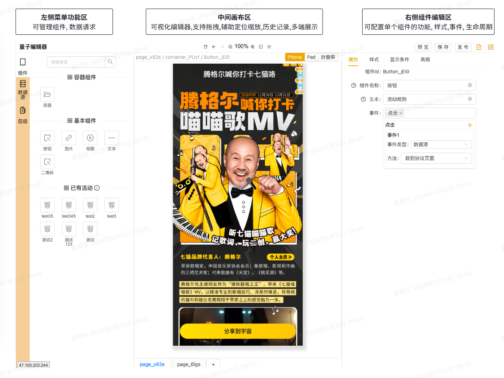

# 快速开始
页面地址: [quantum-editor](https://quantum-editor.qmniu.com/quantum-editor/backend/editor/editor-page)
## 工作区介绍
 

> 1. 面包屑: 展示当前的页面信息与页面层级  
> 2. 画布页面: 展示预览信息  
> 3. 分页信息: 展示页面信息, 根据右侧的配置信息展示  
> 4. 编辑器页面: 可对schemas进行编辑  

### 编辑器页面
详细的输入规则参考[/api/schema/](/api/schema/);

保存: command + s 进行临时保存预览, 点击右上角的预览或保存可保存至服务器

预览: 点击预览可预览与生产环境保持一致的最终项目, 、

可拥有两种输入模式
1. 按照[schema](/api/schema/)输入全面的json配置,进行全面配置
2. 输入[schema](/api/schema/)中的`ISchemasNode[]`, 进行单页编辑