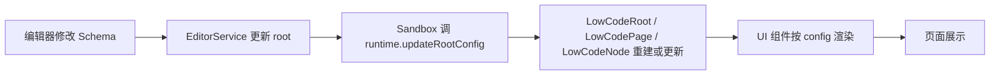
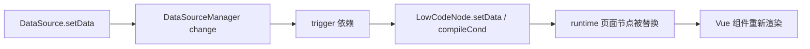

# 00-新人30分钟了解项目精髓

## 一句话理解项目

这是一个把页面结构存成 `Schema`，再通过 `Core + Runtime` 执行出来，同时让 `Editor + Sandbox` 提供可视化编辑体验的低代码引擎。

## 先记住 4 个判断

### 1. `Schema` 是单一事实来源

编辑器里你看到的树、属性面板里的值、运行时渲染出的页面，本质都来自同一份 `ISchemasRoot`。

新人只要抓住这一点，很多问题都会简单很多：

- 为什么改属性会刷新画布
- 为什么切页只是在切 `page.field`
- 为什么复制粘贴本质上是在复制节点配置

### 2. `Editor` 不负责渲染业务组件

`packages/editor` 维护的是编辑态状态和操作能力，例如：

- 当前选中了谁
- 往哪个父节点里加新节点
- 历史记录怎么回退
- 属性变化后如何同步给画布

真正的页面渲染发生在 iframe 里的 runtime，而不是编辑器自己。

### 3. `Sandbox` 不是运行时，它只是编辑桥

`packages/sandbox` 的职责非常纯粹：

- 用 `iframe` 托起一个隔离运行环境
- 把编辑器里的“增删改查、选中、高亮、拖拽缩放”映射到 iframe 页面
- 反过来把 iframe 内页面尺寸、元素位置、选中元素反馈给编辑器

所以它更像“编辑态控制层”，不是业务渲染层。

### 4. `Core` 才是执行引擎

`packages/core` 里的 `LowCodeRoot / LowCodePage / LowCodeNode` 负责：

- 建立页面节点树
- 编译模板表达式，例如 `${user.name}`
- 绑定生命周期和事件
- 收集数据源依赖
- 在数据变化时重新计算节点数据和显示条件

如果把项目类比成前端框架，`Core` 更接近运行时内核。

## 30 分钟阅读路径

### 第 1 步：看项目骨架

重点目录：

```text
apps/
  playground/        编辑器演示应用
  quantum-docs/      文档站
packages/
  core/              页面执行内核
  editor/            编辑器状态和界面
  sandbox/           iframe 画布桥接层
  data-source/       数据源与依赖触发
  ui/                Vue3 运行时组件库
  ui-vue2/           Vue2 运行时组件库
  schemas/           Schema 类型协议
  utils/             通用工具
runtime/
  vue3-active/       Vue3 runtime
  vue2-active/       Vue2 runtime
```

### 第 2 步：看真正的主链路

主链路只有一条：



数据源主链路是另一条：



### 第 3 步：记住几个关键文件

- `packages/core/src/app.ts`
  - 入口根实例，负责 `setConfig`、`setPage`、事件注册、组件注册
- `packages/core/src/node.ts`
  - 节点编译中心，模板表达式、条件显示、生命周期、事件包装都在这里
- `packages/data-source/src/utils/deps.ts`
  - 数据依赖收集和触发的核心实现
- `packages/editor/src/services/editor-service.ts`
  - 编辑器最重要的状态流入口
- `packages/sandbox/src/box-render.ts`
  - iframe 通信和 runtime 接口桥接
- `runtime/vue3-active/playground/App.vue`
  - 编辑态 runtime 对外暴露 `updateRootConfig / select / add / update / delete`
- `packages/ui/src/q-component/src/component.vue`
  - 动态组件渲染入口

## 新人最容易误解的点

### 1. 不是“拖拽驱动渲染”，而是“Schema 驱动渲染”

拖拽只是修改 Schema 的一种手段。

### 2. 不是“编辑器直接操作 DOM”，而是“编辑器改 Schema，Sandbox 同步 iframe”

DOM 操作主要发生在选中、高亮、拖拽蒙层和 Moveable 控制器层面，不是页面内容的真源头。

### 3. 不是“数据源直接驱动 Vue 组件”，而是“数据源先驱动 LowCodeNode，再驱动页面配置”

这个中间层很关键，它决定了：

- 模板表达式如何重算
- `ifShow` 如何重算
- 生命周期与事件如何继续成立

## 新人上手时最有价值的调试顺序

当你发现“改了没生效”，按这个顺序查：

1. `root` 里的 Schema 是否已经变了
2. runtime 是否收到了 `updateRootConfig` / `update`
3. `LowCodeNode.setData` 是否被执行
4. `componentProps` / `style` 是否已经变成最终值
5. UI 组件是否真的消费了这些值

## 一句话收尾

想快速上手这个项目，不要先盯界面，先盯 `Schema -> Core -> Runtime` 这条线；界面只是这条线在编辑态的投影。
