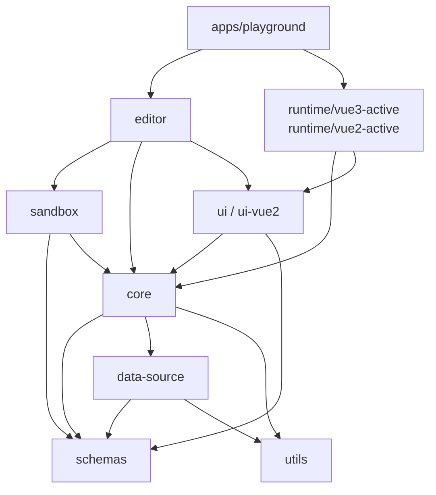

# 01-总览

## Monorepo 分层

项目使用 `pnpm workspace + turbo` 组织多包仓库，结构上可以分成 4 层。

### 1. 应用层

- `apps/playground`
  - 把编辑器组装成一个可运行的演示应用
- `apps/quantum-docs`
  - 文档站

### 2. 编辑层

- `packages/editor`
  - 编辑态状态管理、组件面板、属性面板、历史记录、画布挂载
- `packages/sandbox`
  - iframe、蒙层、选中框、拖拽缩放、多选、辅助线

### 3. 执行层

- `packages/core`
  - 低代码页面执行内核
- `packages/data-source`
  - 数据源实例化、依赖收集、依赖触发

### 4. 协议与渲染层

- `packages/schemas`
  - Schema 类型协议
- `packages/ui`
  - Vue3 运行时组件和组件配置元数据
- `packages/ui-vue2`
  - Vue2 运行时组件和组件配置元数据
- `runtime/vue3-active`
  - Vue3 runtime 壳
- `runtime/vue2-active`
  - Vue2 runtime 壳

## 从启动到可编辑的完整链路

以 `apps/playground` 为例，启动后发生的事情可以概括成下面 8 步：

1. Playground 组装 `QuantumEditor`
2. `QuantumEditor` 初始化各类 service
3. `editorService` 接管当前 `ISchemasRoot`
4. Sandbox 创建 iframe，加载 runtime 页面
5. iframe 内 runtime 创建 `LowCodeRoot`
6. runtime 通过 `window.quantum.onRuntimeReady` 把能力暴露给编辑器
7. 编辑器把 root/page 同步给 runtime
8. runtime 使用 UI 组件把当前 page 渲染出来

## 关键包之间的依赖关系

## 仓库里的两个“页面”

这个项目里经常会混淆两种页面：

### 1. 编辑器页面

是你在 `apps/playground/src/views/editor/index.vue` 看到的整套后台界面，包含：

- 顶部工具栏
- 左侧组件面板
- 中间画布
- 右侧属性面板

### 2. 低代码页面

是 `ISchemasRoot.children` 里的 `ISchemasPage`，会被 runtime 渲染成真正用户看到的业务页面。

很多新人第一次改代码会把这两个页面混在一起，导致调试方向错掉。

## 这个项目最重要的设计收益

### 编辑态和运行态解耦

好处是：

- 编辑器不绑定某个具体业务组件实现
- runtime 可以独立部署、独立适配 Vue2/Vue3
- 编辑行为不会直接污染业务页面环境

### Schema 是协议层

好处是：

- 页面可以持久化
- 页面可以跨端、跨运行时复用
- 编辑器和 runtime 可以只通过协议通信

### 数据源依赖是显式收集的

好处是：

- 更新粒度可以控制到“哪个数据源字段影响了哪些节点”
- 模板表达式和条件显示都有统一触发入口

## 阅读源码时建议的入口顺序

如果你想从代码里理解这套架构，推荐顺序如下：

1. `apps/playground/src/views/editor/index.vue`
2. `packages/editor/src/editor.vue`
3. `packages/editor/src/components/layouts/sandbox/index.vue`
4. `packages/sandbox/src/box-core.ts`
5. `runtime/vue3-active/playground/App.vue`
6. `packages/core/src/app.ts`
7. `packages/core/src/node.ts`
8. `packages/data-source/src/utils/deps.ts`
9. `packages/ui/src/q-component/src/component.vue`

## 给新人的一句建议

先把这个项目看成“协议驱动的页面执行器”，再把编辑器看成“这台执行器的可视化操作台”，理解速度会快很多。
