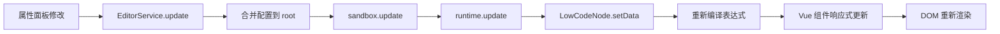
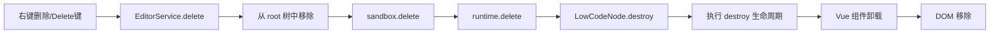
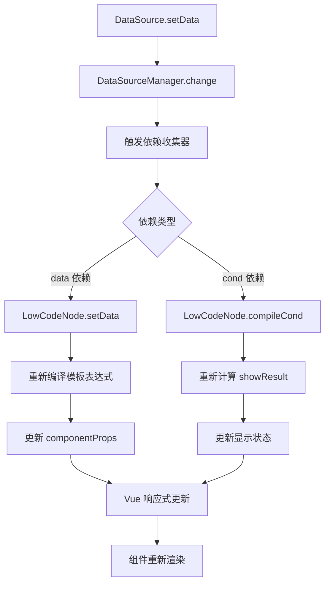
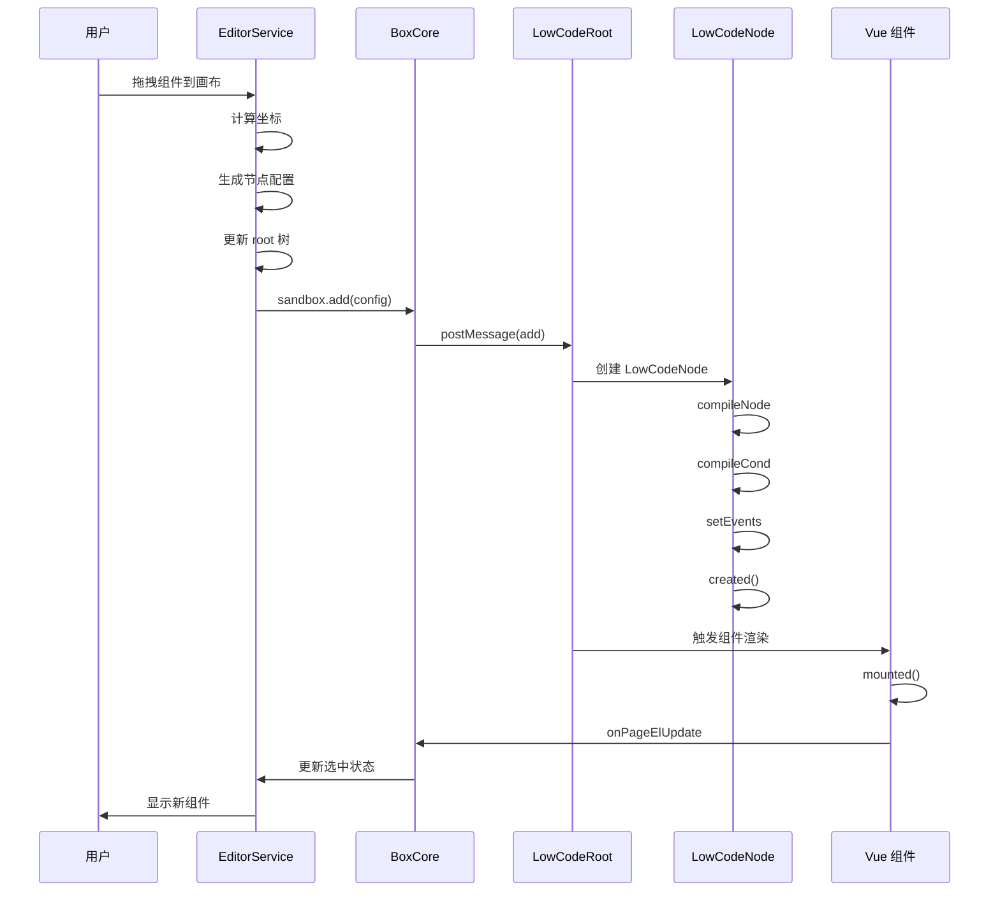

# 08-全链路流程图

## 从拖拽到渲染的完整链路

这是一个从用户在编辑器中拖拽/添加/移动节点，到最终在 runtime 中完成渲染的全景流程图。

## 核心流程图

```mermaid
flowchart TB
    subgraph 用户操作层
        A[用户从组件面板拖拽组件] --> B[鼠标移动到画布]
        B --> C[松开鼠标 - drop 事件]
    end

    subgraph 坐标计算层
        C --> D[dropHandler 计算落点坐标]
        D --> D1[获取 clientX/clientY]
        D1 --> D2[减去 sandbox 容器偏移]
        D2 --> D3[补回滚动偏移 scrollTop/Left]
        D3 --> D4[按 designWidth 换算设计稿坐标]
        D4 --> D5[除以 zoom 抵消缩放]
        D5 --> D6[如果命中容器，减去父容器 offset]
        D6 --> D7[得到最终 Schema 坐标]
    end

    subgraph 编辑器状态层
        D7 --> E[EditorService.add]
        E --> E1[生成新节点配置]
        E1 --> E2[找到父节点]
        E2 --> E3[插入到 root 配置树]
        E3 --> E4[更新 editorService.state.root]
    end

    subgraph Sandbox 通信层
        E4 --> F[sandbox.add]
        F --> F1[BoxRender 调用 runtime 接口]
        F1 --> F2[通过 iframe postMessage]
        F2 --> F3[runtime.add 接收消息]
    end

    subgraph Runtime 执行层
        F3 --> G[LowCodeRoot.add]
        G --> G1[创建 LowCodeNode 实例]
        G1 --> G2[compileNode - 编译模板表达式]
        G2 --> G3[compileCond - 编译显示条件]
        G3 --> G4[setEvents - 包装事件配置]
        G4 --> G5[注册数据源依赖]
        G5 --> G6[执行 created 生命周期]
    end

    subgraph 组件渲染层
        G6 --> H[Vue 组件树更新]
        H --> H1[q-component 动态渲染]
        H1 --> H2[resolveComponent 解析组件]
        H2 --> H3[传入 componentProps]
        H3 --> H4[应用 style 样式]
        H4 --> H5[执行 mounted 生命周期]
        H5 --> H6[组件渲染到 DOM]
    end

    subgraph 编辑反馈层
        H6 --> I[runtime 通知编辑器]
        I --> I1[onPageElUpdate 触发]
        I1 --> I2[BoxMask 更新选中框]
        I2 --> I3[ActionManager 更新交互层]
        I3 --> I4[HistoryService 记录历史]
        I4 --> I5[用户看到新组件]
    end

    style A fill:#e1f5ff
    style E fill:#fff4e1
    style G fill:#ffe1f5
    style H fill:#e1ffe1
    style I5 fill:#e1f5ff
```



## 数据流向详解

### 1. 用户操作 → 坐标计算

**关键文件**: `packages/editor/src/components/layouts/sandbox/index.vue`

```text
用户拖拽 → DragEvent
         → clientX/clientY (浏览器视口坐标)
         → 减去 containerRect (sandbox 可视坐标)
         → 加上 scrollTop/Left (页面真实坐标)
         → 乘以 designWidth/pageWidth (设计稿坐标)
         → 除以 zoom (Schema 存储坐标)
```

**坐标系转换公式**:

```js
// 1. 获取可视坐标
visibleLeft = e.clientX - containerRect.left
visibleTop = e.clientY - containerRect.top

// 2. 补回滚动（absolute 布局）
pageLeft = visibleLeft + scrollLeft
pageTop = visibleTop + scrollTop

// 3. 转换为设计稿坐标
designLeft = pageLeft * designWidth / pageRenderedWidth
designTop = pageTop * designWidth / pageRenderedWidth

// 4. 抵消编辑器缩放
schemaLeft = designLeft / zoom
schemaTop = designTop / zoom

// 5. 如果命中容器，转为相对坐标
if (parent) {
  schemaLeft -= parentLeft
  schemaTop -= parentTop
}
```

### 2. Schema 更新 → 状态同步

**关键文件**: `packages/editor/src/services/editor-service.ts`

```text
EditorService.add
  ├─ 生成节点配置 (field, component, componentProps, style)
  ├─ 找到父节点 (parent)
  ├─ 插入 root 树 (root.children[].children.push)
  ├─ 更新状态 (state.root = newRoot)
  ├─ 调用 sandbox.add
  ├─ 修正初始位置
  ├─ 更新选中状态 (state.node = newNode)
  └─ 推入历史记录 (historyService.push)
```

**双写同步机制**:

- 先改 Schema (editorService.state.root)
- 再通知 runtime (sandbox.add)
- 保证配置树和视图一致

### 3. Sandbox 桥接 → Runtime 通信

**关键文件**: `packages/sandbox/src/box-render.ts`

```text
sandbox.add
  ├─ BoxRender.add
  ├─ 调用 runtime.add 接口
  ├─ 通过 iframe postMessage
  └─ runtime 接收并处理
```

**通信接口**:

```js
// runtime 暴露的接口
window.quantum.onRuntimeReady({
  getApp,
  updateRootConfig,
  updatePageField,
  select,
  add,      // ← 新增节点
  update,   // ← 更新节点
  delete    // ← 删除节点
})
```

### 4. Runtime 执行 → 节点编译

**关键文件**: `packages/core/src/node.ts`

```text
LowCodeNode 创建
  ├─ compileNode
  │   ├─ 识别模板表达式 ${dataSource.field}
  │   ├─ 向 DataSourceManager 注册依赖
  │   └─ 编译成最终值
  ├─ compileCond
  │   ├─ 解析 ifShow 条件数组
  │   ├─ 注册条件依赖
  │   └─ 计算 showResult
  ├─ setEvents
  │   ├─ 包装事件配置
  │   └─ 转成真正的函数
  └─ 执行 created 生命周期
```

**模板表达式编译**:

```js
// Schema 中
componentProps: {
  text: '${user.name}'
}

// 编译后
componentProps: {
  text: '张三'  // 从 dataSourceManager.data.user.name 取值
}

// 同时注册依赖
deps.track({
  field: 'Text_userName',
  rawValue: '${user.name}',
  key: 'componentProps.text',
  type: 'data'
})
```

**条件显示编译**:

```js
// Schema 中
ifShow: [
  {
    field: ['user', 'level'],
    op: '>=',
    value: 3,
    range: []
  }
]

// 编译后
showResult: true  // user.level >= 3

// 同时注册依赖
deps.track({
  field: 'VipText',
  rawValue: ['user', 'level'],
  key: 'ifShow',
  type: 'cond'
})
```

### 5. 组件渲染 → DOM 输出

**关键文件**: `packages/ui/src/q-component/src/component.vue`

```text
q-component
  ├─ resolveComponent(config.component)
  ├─ 传入 componentProps
  ├─ 应用 style
  ├─ 判断 showResult 和 ifShow
  ├─ 执行 mounted 生命周期
  └─ 渲染到 DOM
```

**动态组件解析**:

```vue
<component
  :is="comp"
  v-bind="config.componentProps"
  :style="config.style"
  v-if="shouldShow"
/>
```

### 6. 编辑反馈 → 交互更新

**关键文件**: `packages/sandbox/src/box-mask.ts`

```text
runtime 渲染完成
  ├─ onPageElUpdate 触发
  ├─ BoxMask 更新选中框位置
  ├─ ActionManager 更新交互层
  ├─ Moveable 绑定拖拽缩放
  └─ 用户看到新组件和选中框
```

## 节点更新流程



**更新链路**:

1. 用户在属性面板修改值
2. `EditorService.update` 更新 Schema
3. `sandbox.update` 通知 runtime
4. `LowCodeNode.setData` 重新编译
5. Vue 响应式触发组件更新
6. DOM 自动重新渲染

## 节点删除流程



## 数据源驱动流程



**数据驱动示例**:

```js
// 1. 初始状态
dataSourceManager.data.user.name = '张三'
// Text 组件显示 "张三"

// 2. 数据更新
dataSourceManager.setData({ name: '李四' }, 'user.name')

// 3. 触发依赖
deps.trigger('user', 'name')

// 4. 重新编译
node.setData()  // componentProps.text = '李四'

// 5. Vue 更新
// Text 组件自动显示 "李四"
```

## 关键时序图



## 核心概念总结

### 1. Schema 是单一事实来源

- 所有状态最终存储在 `ISchemasRoot`
- 编辑器和 runtime 都从 Schema 读取
- 修改必须先改 Schema，再同步视图

### 2. 编辑器不渲染业务组件

- `packages/editor` 只管理编辑态状态
- 真正的页面渲染在 iframe 的 runtime 中
- 编辑器通过 sandbox 桥接 runtime

### 3. Sandbox 是编辑桥，不是运行时

- 负责 iframe 挂载和通信
- 维护选中框、蒙层、辅助线
- 承接拖拽、缩放、多选交互

### 4. Core 是执行引擎

- `LowCodeNode` 负责节点编译和执行
- 处理模板表达式、条件显示、事件包装
- 管理数据源依赖和生命周期

### 5. 坐标系转换是关键

- 浏览器视口坐标 → sandbox 可视坐标
- 可视坐标 → runtime 页面坐标
- 页面坐标 → 设计稿坐标
- 设计稿坐标 → Schema 存储坐标

## 常见问题排查

### 问题 1: 拖入位置不对

**排查顺序**:

1. 检查 `clientX/clientY` 是否正确
2. 检查 `containerRect` 是否正确
3. 检查 `scrollTop/Left` 是否补回
4. 检查 `zoom` 是否参与计算
5. 检查 `designWidth` 是否一致
6. 检查父容器 offset 是否扣除

### 问题 2: 修改没生效

**排查顺序**:

1. 检查 `root` 中的 Schema 是否已变
2. 检查 runtime 是否收到 `update`
3. 检查 `LowCodeNode.setData` 是否执行
4. 检查 `componentProps` 是否已更新
5. 检查 UI 组件是否消费了新值

### 问题 3: 数据绑定不更新

**排查顺序**:

1. 检查模板表达式语法是否正确
2. 检查数据源 id 和字段名是否匹配
3. 检查依赖是否正确注册
4. 检查 `setData` 是否触发依赖
5. 检查 `compileNode` 是否重新执行

### 问题 4: 条件显示不生效

**排查顺序**:

1. 检查 `ifShow` 格式是否正确
2. 检查 `field` 数组是否完整
3. 检查操作符是否支持
4. 检查数据源字段值是否正确
5. 检查 `showResult` 计算结果

## 新人上手建议

### 第一周: 理解主链路

1. 从 `apps/playground` 启动项目
2. 拖一个组件到画布
3. 在 Chrome DevTools 中打断点跟踪
4. 重点关注: `EditorService.add` → `sandbox.add` → `LowCodeNode` 创建

### 第二周: 理解坐标系

1. 阅读 `sandbox/index.vue` 的 `dropHandler`
2. 理解 4 套坐标系的转换
3. 修改 `zoom` 和 `designWidth` 观察变化
4. 理解为什么要除以 `zoom`

### 第三周: 理解数据驱动

1. 阅读 `packages/core/src/node.ts`
2. 理解模板表达式编译
3. 理解条件显示编译
4. 理解依赖收集和触发

### 第四周: 理解组件渲染

1. 阅读 `packages/ui/src/q-component`
2. 理解动态组件解析
3. 理解生命周期连接
4. 理解 `useApp` 钩子

## 总结

这个低代码引擎的核心设计理念是:

1. **Schema 驱动**: 一切状态来自配置树
2. **编辑运行分离**: 编辑器和 runtime 通过 iframe 隔离
3. **协议通信**: 通过标准接口桥接两端
4. **依赖驱动**: 数据变化自动触发节点更新
5. **坐标转换**: 多套坐标系精确换算

理解了这 5 个核心概念，就能快速上手这个项目。
