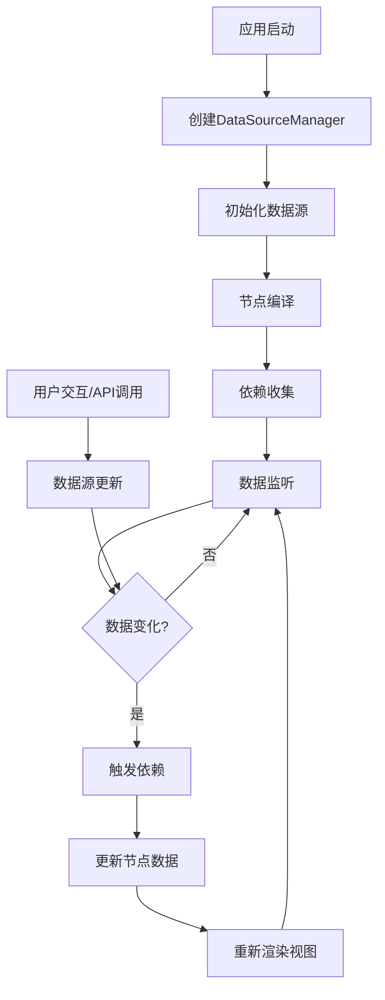
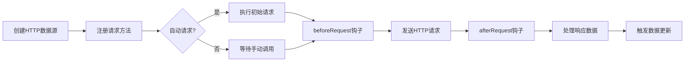

# 数据源（DataSource）原理与工作流程

## 概述

数据源系统是低代码平台的核心组件之一，负责管理应用中的数据流动、依赖跟踪和响应式更新。系统采用发布-订阅模式结合依赖收集机制，实现了数据驱动的响应式渲染。

## 核心架构

### 1. 类层次结构

```
DataSourceManager (数据源管理器)
├── DataSource (基础数据源)
│   └── HttpDataSource (HTTP数据源)
├── 依赖跟踪系统 (deps.ts)
└── 工具函数 (tools.ts)
```

### 2. 主要组件

- **DataSourceManager**: 数据源管理器，负责统一管理所有数据源
- **DataSource**: 基础数据源类，提供基本的数据管理功能
- **HttpDataSource**: HTTP数据源，扩展了网络请求能力
- **依赖跟踪系统**: 负责收集和触发数据依赖关系

## 工作流程

### 整体流程图



### 详细步骤解析

#### 步骤1：初始化阶段

**1.1 创建数据源管理器**
```typescript
// 在应用启动时创建
const dataSourceManager = new DataSourceManager({
    app,
    useMock: false
});
```

**1.2 注册数据源**
```typescript
// 根据配置创建不同类型的数据源
if (config.type === 'http') {
    ds = new HttpDataSource({
        app: this.app,
        schema: config,
        useMock: this.useMock,
        request: this.app.request
    });
} else {
    ds = new DataSource({
        app: this.app,
        schema: config,
        useMock: this.useMock
    });
}
```

**1.3 数据源初始化**
```typescript
// 处理生命周期钩子
const beforeInit = []; // beforeInit 钩子
const afterInit = [];  // afterInit 钩子

// 注册全局事件
this.app.registerEvent(`${ds.id}:${method.name}`, method.content, ds);

// 执行初始化
await ds.init();
```

#### 步骤2：依赖收集阶段

**2.1 初始化 LowCodeNode**

```typescript
constructor(options: INodeOptions) {
    super(); // 调用父类构造函数，初始化事件系统

    // 建立节点关系
    this.page = options.page;
    this.parent = options.parent;
    this.root = options.root;
    this.data = options.config;

    // 如果需要立即初始化，则进行数据编译和事件绑定
    if (options.init) {
        this.setData(options.config); // 编译节点数据并收集依赖
        this.setEvents(this.data); // 绑定事件处理器
    }
}

setData(data: ISchemasNode | ISchemasContainer | ISchemasPage) {
    tthis.data = this.compileNode(data);
    // 编译条件显示逻辑，收集条件依赖
    this.compileCond(this.data);
    // 发出数据更新事件，通知相关组件重新渲染
    this.emit('update-data');
}

/**
 * 设置事件处理器
 *
 * 处理节点配置中的事件绑定，支持两种事件绑定方式：
 * 方式1 - 函数式（适用于代码模式）：
 * onClick: (app, e) => { app.emit('datasourceId:funcName', e) }
 *
 * 方式2 - 配置式（适用于可视化配置）：
 * onClick: [
 *   {field: 'nodeId:funcName', params: {}},
 *   {field: 'datasourceId:funcName', params: {}}
 * ]
 * 最终转化为方法，通过 app.emit 触发事件
 * @param config 节点配置数据
 */
public setEvents(config: ISchemasNode | ISchemasContainer) {
    // 检查组件属性是否存在且为对象
    if (config.componentProps && isObject(config.componentProps)) {
        // 遍历所有组件属性
        for (const [key, val] of Object.entries(config.componentProps)) {
            // 处理函数式事件绑定
            if (isFunction(val)) {
                const fn = (...args: any[]) => {
                    val(this.root, ...args);
                };
                config.componentProps[key] = fn;
            }
            // 处理配置式事件绑定
            else if (isArray(val) && val[0]?.field) {
                // 创建事件处理函数，支持链式调用多个事件
                const fn = () => {
                    for (const item of val) {
                        const { field, params = {} } = item;
                        // 通过全局事件总线触发事件
                        this.root.emit(`${field}`, params);
                    }
                };
                config.componentProps[key] = fn;
            }
        }
    }
}
```

**2.2 节点编译过程**
```typescript
// 在 node.ts 中的 compileNode 方法 
public compileNode(data: ISchemasNode | ISchemasContainer | ISchemasPage) {
    return compiledNode(data, (value, key) => {
        if (this.page) {
            const path = value.replace(/\$\{([^}]+)\}/, '\$1');
            const [sourceId, fieldId, ..._args] = path.split('.');
            // 收集依赖
            this.root.dataSourceManager?.track(sourceId, fieldId, {
                field: this.data.field,
                rawValue: value,
                key: key!,
                type: 'data',
            });
        }
        // 编译模板
        if (typeof value === 'string') {
            const data = template(value)(this.root.dataSourceManager?.data);
            return stringToBoolean(data);
        }
    });
}
```

**2.3 条件依赖收集**
```typescript
// 收集条件显示依赖
public compileCond(data: ISchemasNode | ISchemasContainer | ISchemasPage) {
    if (this.page && isArray(data.ifShow)) {
        for (const cond of data.ifShow) {
            const [sourceId, fieldId, ..._args] = cond.field;
            if (fieldId) {
                this.root.dataSourceManager?.track(sourceId, fieldId, {
                    field: this.data.field,
                    rawValue: '',
                    key: '',
                    type: 'cond',
                });
            }
        }
    }
}
```

**2.4 依赖存储结构**
```typescript
// 依赖关系存储在 Map 结构中
// dataSourceDep: Map<dataSourceId, Map<fieldId, Set<IDepEffect>>>
interface IDepEffect {
    field: Id;        // 节点ID
    key: string;      // 属性路径
    rawValue: string; // 原始值
    type: 'data' | 'cond'; // 依赖类型
}
```

#### 步骤3：数据更新阶段

**3.1 数据源变化监听**
```typescript
// 在 DataSource 中触发变化事件
public setData(data: Record<string, any>, path?: string) {
    if (path) {
        js_utils_edit_attr(path, data, this.data);
    } else {
        this.data = data;
    }
    const changeEvent: ChangeDataEvent = {
        updateData: data,
        path
    };
    this.emit('change', changeEvent);
}
```

**3.2 管理器响应变化**
```typescript
// DataSourceManager 监听变化
ds.on('change', (cdata: ChangeDataEvent) => {
    this.setData(ds, cdata);
});

public setData(ds: DataSource, cdata: any) {
    Object.assign(this.data[ds.id], ds.data);
    this.emit('change', ds.id, cdata);
}

// 触发依赖更新
dataSourceManager.on('change', (sourceId: string, changeData: ChangeDataEvent) => {
    const fieldId = changeData.path?.split('.')?.[0];
    const nodes = dataSourceManager.trigger(sourceId, fieldId);
    dataSourceManager.emit('update-data', nodes, sourceId, changeData);
});
```

#### 步骤4：依赖触发阶段

**4.1 触发依赖更新**
```typescript
// 在 deps.ts 中的 trigger 函数
export function trigger(sourceManage: ISourceManage, dataSourceId: Id, fieldId?: string): ISchemasNode[] {
    const { data, dataSourceDep, app } = sourceManage;
    const depsMap = dataSourceDep.get(dataSourceId);
    
    if (!depsMap) return [];
    
    const nodes = [];
    const dep = depsMap.get(fieldId);
    
    if (!dep) return [];
    
    const effects = [...dep];
    for (let eff of effects) {
        eff = JSON.parse(eff);
        const { key, rawValue, field } = eff as IDepEffect;
        const paths = getNodePath(field, app.schemasRoot?.children || []);
        
        if (paths.length) {
            const curNode = paths.pop();
            switch (eff.type) {
                case 'data':
                    // 更新数据依赖
                    js_utils_edit_attr(key, rawValue, curNode);
                    break;
                case 'cond':
                    // 更新条件依赖
                    curNode.showResult = compliedConditions(curNode, data);
                    break;
            }
            
            // 更新节点
            if (isPage(curNode)) {
                app.page.setData(curNode);
            } else {
                const n = app.page.getNode(curNode.field);
                n.setData(curNode);
            }
            nodes.push(curNode);
        }
    }
    return nodes;
}
```

#### 步骤5：视图更新阶段

**5.1 Vue组件响应更新**
```typescript
// 在 App.vue 中监听 update-data 事件
app?.dataSourceManager?.on('update-data', (nodes: ISchemasNode[], sourceId: string, data: any) => {
    // 创建页面配置的深拷贝
    const newPageConfig = js_utils_deep_copy(pageConfig.value);

    nodes.forEach((node) => {
        // 在拷贝的数据上进行更新
        replaceChildNode(node, [newPageConfig]);
    });

    // 重新赋值整个配置对象来触发响应式更新
    pageConfig.value = newPageConfig;
    updateKey.value++;

    if (!app) return;

    nextTick(() => {
        app.emit('replaced-node', { nodes, sourceId, data });
    });
});
```

## HTTP数据源特性

### 请求生命周期



### 请求拦截器

```typescript
// 请求前拦截
if (typeof this.schema.beforeRequest === 'function') {
    reqOptions = this.schema.beforeRequest(reqOptions, { app: this.app, dataSource: this });
}

// 响应后拦截
if (typeof this.schema.afterResponse === 'function') {
    res = this.schema.afterResponse(res, { app: this.app, dataSource: this });
}
```

## 依赖跟踪机制

### 收集时机

1. **节点编译时**: 当模板中包含 `${dataSource.field}` 语法时
2. **条件编译时**: 当节点的 `ifShow` 属性引用数据源字段时
3. **事件绑定时**: 当事件处理函数引用数据源时

### 触发时机

1. **数据源数据变化**: 调用 `setData` 方法时
2. **HTTP请求完成**: 请求成功后更新数据时
3. **手动触发**: 调用 `trigger` 方法时

### 依赖类型

- **data依赖**: 用于数据绑定，更新节点属性值
- **cond依赖**: 用于条件显示，控制节点的显示/隐藏

## 性能优化

### 1. 按需更新
- 只更新有依赖关系的节点
- 支持路径级别的精确更新

### 2. 批量处理
- 合并同一数据源的多个字段更新
- 异步处理避免阻塞UI

### 3. 内存管理
- 自动清理已删除节点的依赖关系
- 数据源销毁时清理相关资源

## 使用示例

### 基础数据源

```typescript
const dataSource = {
    id: 'userInfo',
    type: 'base',
    fields: [
        { name: 'name', type: 'string', defaultValue: '' },
        { name: 'age', type: 'number', defaultValue: 0 }
    ],
    methods: [
        {
            name: 'updateName',
            content: (params) => {
                this.setData({ name: params.name });
            }
        }
    ]
};
```

### HTTP数据源

```typescript
const httpDataSource = {
    id: 'apiData',
    type: 'http',
    options: {
        url: '/api/users',
        method: 'GET'
    },
    autoFetch: true,
    responseOptions: {
        dataPath: 'data.list'
    },
    beforeRequest: (options) => {
        options.headers = { ...options.headers, 'Authorization': 'Bearer token' };
        return options;
    },
    afterResponse: (response) => {
        return response.data;
    }
};
```

### 模板使用

```typescript
const nodeConfig = {
    field: 'textNode',
    componentName: 'Text',
    componentProps: {
        text: '${userInfo.name}',  // 数据绑定
        visible: true
    },
    ifShow: [  // 条件显示
        {
            field: ['userInfo', 'age'],
            op: 'gt',
            value: 18
        }
    ]
};
```

## 关键数据结构

### 依赖收集结构

```typescript
// 依赖映射表结构
Map<dataSourceId, Map<fieldId, Set<IDepEffect>>>

// 依赖效应对象
interface IDepEffect {
    field: Id;        // 节点ID
    key: string;      // 属性路径 (如: componentProps.text)
    rawValue: string; // 原始模板值 (如: ${userInfo.name})
    type: 'data' | 'cond'; // 依赖类型
}

// 数据变化事件
interface ChangeDataEvent {
    path?: string;    // 变化的数据路径
    updateData: any;  // 更新后的数据
}
```

### 数据源配置结构

```typescript
// 基础数据源配置
interface IDataSourceSchema {
    id: string;
    type: 'base' | 'http';
    fields: IDataSchema[];
    methods: ICodeBlockContent[];
    mocks?: {
        data?: Record<string, any>;
    };
}

// HTTP数据源配置
interface IHttpDataSourceSchema extends IDataSourceSchema {
    type: 'http';
    options: IHttpOptions;
    responseOptions?: {
        dataPath?: string;
    };
    autoFetch?: boolean;
    beforeRequest?: (options: IHttpOptions, context: any) => IHttpOptions;
    afterResponse?: (response: any, context: any) => any;
}
```

## 调试和监控

### 依赖关系查看

```typescript
// 查看数据源的依赖关系
const dependencies = dataSourceManager.dataSourceDep.get('dataSourceId');
console.log('依赖关系:', dependencies);

// 查看当前数据源数据
console.log('数据源数据:', dataSourceManager.data);
```

### 事件监听调试

```typescript
// 监听数据变化事件
dataSourceManager.on('change', (sourceId, changeData) => {
    console.log(`数据源 ${sourceId} 发生变化:`, changeData);
});

// 监听节点更新事件
dataSourceManager.on('update-data', (nodes, sourceId, data) => {
    console.log(`触发 ${nodes.length} 个节点更新:`, nodes);
});
```

## 常见问题和解决方案

### 1. 依赖未正确收集

**问题**: 节点数据未响应数据源变化
**原因**: 模板语法不正确或依赖收集时机错误
**解决**: 
- 确保使用正确的模板语法 `${dataSourceId.fieldId}`
- 检查节点是否在页面初始化后创建

### 2. 循环依赖问题

**问题**: 数据更新时出现死循环
**原因**: 数据源之间存在相互依赖
**解决**: 
- 避免数据源之间的循环引用
- 使用标志位防止重复触发

### 3. 内存泄漏

**问题**: 长时间运行后内存占用增长
**原因**: 依赖关系未正确清理
**解决**: 
- 节点销毁时及时清理依赖
- 定期检查和清理无效依赖

### 4. 性能问题

**问题**: 大量节点更新时性能下降
**原因**: 未进行批量更新优化
**解决**: 
- 使用 `nextTick` 进行批量更新
- 按需更新，避免全量重新渲染

## 最佳实践

### 1. 数据源设计

- **单一职责**: 每个数据源只负责一类数据
- **合理粒度**: 避免过于细粒度的字段拆分
- **缓存策略**: 对于不常变化的数据使用适当缓存

### 2. 依赖管理

- **明确依赖**: 避免隐式依赖关系
- **最小依赖**: 只依赖必要的字段
- **及时清理**: 组件销毁时清理相关依赖

### 3. 错误处理

- **异常捕获**: 对数据源操作进行适当的异常处理
- **降级策略**: 提供数据获取失败时的降级方案
- **用户反馈**: 及时向用户反馈数据加载状态

## 总结

数据源系统通过以下机制实现了高效的响应式数据管理：

1. **统一管理**: DataSourceManager 统一管理所有数据源实例
2. **依赖收集**: 在节点编译时自动收集数据依赖关系
3. **响应式更新**: 数据变化时自动触发相关节点更新
4. **类型扩展**: 支持多种数据源类型，如基础数据源和HTTP数据源
5. **生命周期**: 完整的数据源生命周期管理
6. **性能优化**: 按需更新和批量处理机制

这套机制确保了低代码平台中数据流的高效管理和视图的及时更新，为构建复杂的交互式应用提供了强大的基础支撑。通过合理的设计和使用，可以构建出性能优异、维护性良好的低代码应用。
