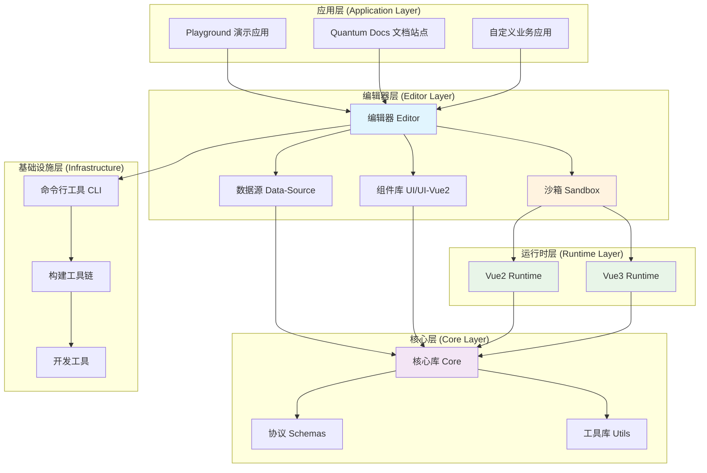
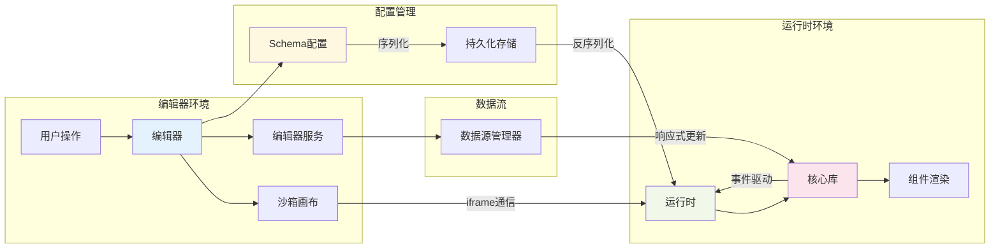
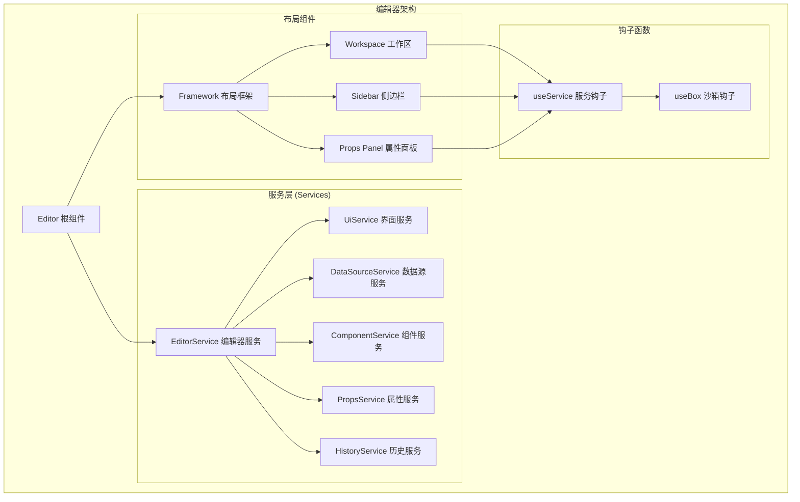
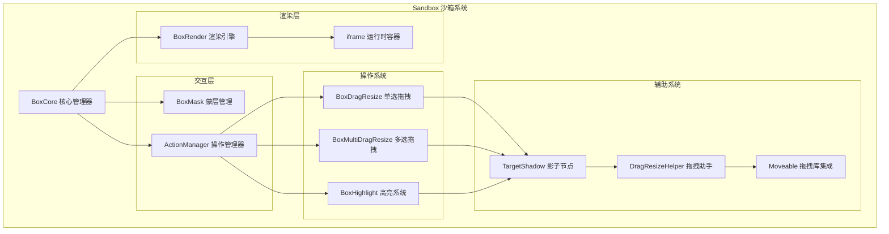
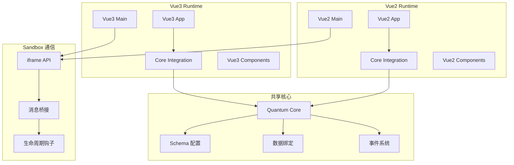
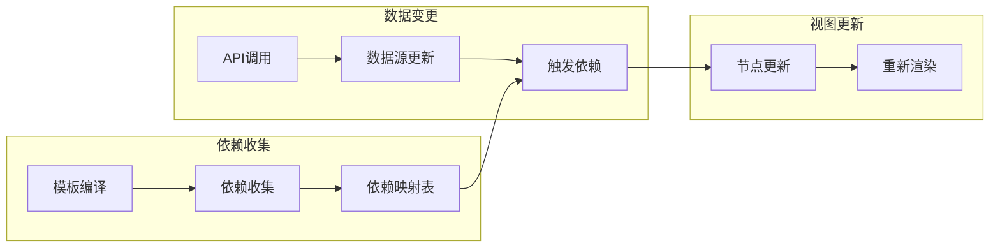
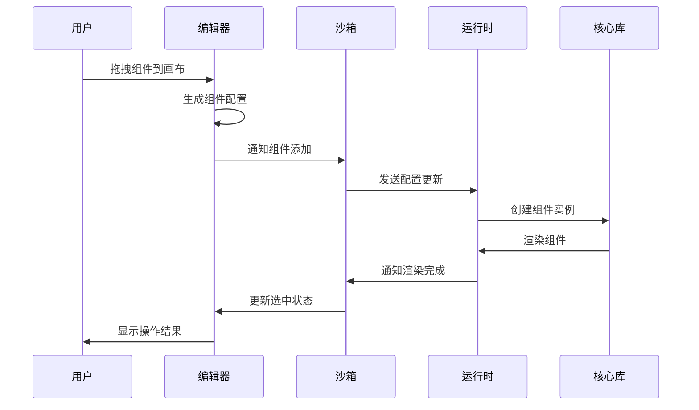
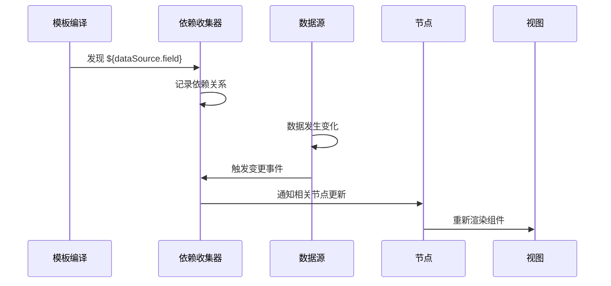
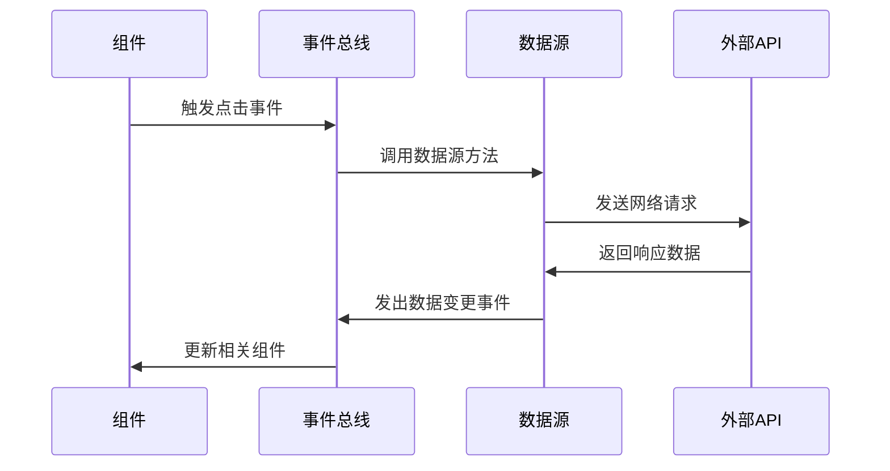

# Quantum 低代码平台总览

## 概述

Quantum 是一个面向企业级应用的可视化低代码搭建平台，旨在通过拖拽式组件编排和配置化开发，大幅提升前端开发效率。平台采用现代化的技术栈和工程架构，支持多种前端框架，提供了完整的从设计到发布的解决方案。

### 🎯 设计理念

- **可视化优先**：通过拖拽、配置实现大部分开发需求
- **代码友好**：支持可视化与代码开发的无缝切换
- **组件化**：基于组件的可复用设计理念
- **数据驱动**：强大的数据绑定和响应式更新机制
- **多框架支持**：同时支持 Vue2 和 Vue3 运行时
- **企业级**：满足复杂业务场景和大型项目需求

## 🏗️ 整体架构

### 分层架构图



### 模块间交互关系



## 📦 核心模块详解

### 1. Core（核心库）

**位置：** `packages/core/`  
**职责：** 数据模型管理、事件系统、运行时架构的核心实现

#### 核心功能
- **LowCodeRoot**：应用根实例，管理全局配置和生命周期
- **LowCodePage**：页面实例，管理页面级别的节点和数据
- **LowCodeNode**：节点实例，管理单个组件的配置和状态
- **Env**：环境检测，识别设备类型和浏览器环境
- **Flexible**：移动端适配，处理响应式布局和单位转换

#### 关键特性
- 🎯 **数据绑定系统**：支持强大的模板表达式 `${dataSource.field}`
- 🎪 **事件系统**：统一的事件总线，支持组件间通信
- 🎨 **样式转换**：自动处理 rem 单位转换和响应式适配
- 🎮 **生命周期管理**：完整的组件创建、挂载、销毁流程
- 🎵 **条件渲染**：复杂的条件显示逻辑支持

```typescript
// 使用示例
import { LowCodeRoot } from '@quantum-lowcode/core';

const app = new LowCodeRoot({
  config: schemas,
  platform: 'mobile',
  designWidth: 375
});

app.registerComponent('Button', ButtonComponent);
app.setPage('homePage');
```

### 2. Editor（编辑器）

**位置：** `packages/editor/`  
**职责：** 提供完整的可视化编辑器界面和功能

#### 架构组成



#### 核心服务详解

**EditorService（编辑器核心服务）**
- 管理编辑器状态（选中节点、页面、根配置等）
- 提供节点增删改查操作
- 协调各个子服务的工作

**UiService（界面服务）**
- 管理编辑器界面状态（面板显示/隐藏、布局尺寸等）
- 控制工作区的视觉反馈
- 处理界面主题和样式配置

**DataSourceService（数据源服务）**
- 管理数据源的创建、编辑、删除
- 处理数据源与组件的绑定关系
- 提供数据预览和调试功能

**ComponentService（组件服务）**
- 管理可用组件列表
- 处理组件的注册和配置
- 提供组件拖拽和实例化功能

### 3. Sandbox（沙箱画布）

**位置：** `packages/sandbox/`  
**职责：** 在编辑器中渲染和操作组件，提供拖拽、选中、高亮等交互功能

#### 核心架构



#### 关键机制

**事件隔离机制**
- 通过透明蒙层拦截所有鼠标事件
- 防止组件原生事件被触发
- 提供统一的交互入口

**坐标转换系统**
- 将蒙层坐标转换为 iframe 内坐标
- 处理缩放、滚动等变换
- 确保交互精度

**影子节点同步**
- 在蒙层上创建与目标组件同步的影子节点
- 实时同步位置、大小、样式
- 支持拖拽预览和视觉反馈

### 4. Runtime（运行时）

**位置：** `runtime/vue2-active/` 和 `runtime/vue3-active/`  
**职责：** 在 iframe 中渲染实际的低代码应用

#### 运行时架构



#### 双运行时支持

**Vue3 Runtime**
- 基于 Vue 3.x 和 Composition API
- 使用 `@quantum-lowcode/ui` 组件库
- 支持最新的 Vue 特性和生态

**Vue2 Runtime**
- 基于 Vue 2.x 和 Options API
- 使用 `@quantum-lowcode/ui-vue2` 组件库
- 向后兼容已有的 Vue2 项目

### 5. Data-Source（数据源）

**位置：** `packages/data-source/`  
**职责：** 统一的数据源管理和响应式更新系统

#### 数据源类型

**BaseDataSource（基础数据源）**
- 本地状态管理
- 支持字段定义和默认值
- 提供数据操作方法

**HttpDataSource（HTTP数据源）**
- 网络请求数据源
- 支持 RESTful API
- 请求拦截器和响应处理
- 自动请求和手动触发

#### 响应式机制



### 6. UI 组件库

**位置：** `packages/ui/` 和 `packages/ui-vue2/`  
**职责：** 提供低代码平台的组件实现

#### 组件设计原则

- **Schema 驱动**：完全基于配置进行渲染
- **属性统一**：标准化的属性接口设计
- **样式隔离**：避免样式冲突和污染
- **事件规范**：统一的事件处理机制

#### 核心组件

| 组件 | 描述 | 特性 |
|------|------|------|
| **QPage** | 页面容器 | 根节点，管理全局样式和布局 |
| **QContainer** | 通用容器 | 支持各种布局方式，可嵌套 |
| **QText** | 文本组件 | 支持富文本和数据绑定 |
| **QButton** | 按钮组件 | 多种样式和交互状态 |
| **QImg** | 图片组件 | 懒加载和响应式适配 |
| **QVideo** | 视频组件 | 多格式支持和控制选项 |
| **QOverlay** | 遮罩层 | 模态框和弹层基础 |

### 7. Schemas（协议定义）

**位置：** `packages/schemas/`  
**职责：** 定义低代码平台的数据结构和类型协议

#### 核心数据结构

```typescript
// 根配置
interface ISchemasRoot {
  id: string;
  designWidth: number;
  children: ISchemasPage[];
  dataSources: IDataSourceSchema[];
}

// 页面配置
interface ISchemasPage {
  field: string;
  type: 'page';
  children: ISchemasNode[];
}

// 组件节点配置
interface ISchemasNode {
  field: string;
  type: string;
  componentProps: Record<string, any>;
  children?: ISchemasNode[];
  ifShow?: ICondition[];
}
```

## 🔄 数据流向和交互流程

### 完整的编辑流程



### 数据绑定流程



### 事件处理流程



## 🛠️ 技术栈和工程化

### 核心技术栈

**前端技术**
- **框架**：Vue 3.x / Vue 2.x + TypeScript
- **构建工具**：Vite + Rollup
- **状态管理**：Pinia + 自定义响应式系统
- **UI 框架**：Ant Design Vue
- **代码编辑器**：Monaco Editor
- **拖拽交互**：Moveable.js
- **样式处理**：Sass/Less

**工程化工具**
- **包管理**：pnpm (Monorepo)
- **构建优化**：Turbo
- **代码规范**：ESLint + Prettier
- **类型检查**：TypeScript
- **版本管理**：Changesets
- **提交规范**：Conventional Commits

### Monorepo 架构

```
quantum-lowcode/
├── apps/                      # 应用目录
│   ├── playground/            # 演示应用
│   └── quantum-docs/          # 文档站点
├── packages/                  # 核心包目录
│   ├── core/                  # 核心库
│   ├── editor/                # 编辑器
│   ├── sandbox/               # 沙箱画布
│   ├── data-source/           # 数据源管理
│   ├── ui/                    # Vue3 组件库
│   ├── ui-vue2/               # Vue2 组件库
│   ├── schemas/               # 协议定义
│   ├── utils/                 # 工具函数
│   └── cli/                   # 命令行工具
├── runtime/                   # 运行时目录
│   ├── vue2-active/           # Vue2 运行时
│   └── vue3-active/           # Vue3 运行时
├── pnpm-workspace.yaml        # pnpm 工作空间配置
└── turbo.json                 # Turbo 构建配置
```

## 🎯 核心优势

### 1. 完整的低代码解决方案
- **设计即开发**：所见即所得的编辑体验
- **代码生成**：自动生成高质量的组件代码
- **多端适配**：支持PC端和移动端应用
- **发布部署**：一键打包和发布功能

### 2. 高度的可扩展性
- **插件系统**：支持自定义组件和功能扩展
- **多框架支持**：Vue2/Vue3双运行时架构
- **自定义组件**：完全自定义的组件开发能力
- **主题定制**：灵活的主题和样式定制

### 3. 企业级特性
- **性能优化**：虚拟滚动、懒加载等优化策略
- **协作开发**：团队协作和版本管理支持
- **权限控制**：细粒度的权限管理系统
- **监控调试**：完善的调试和监控工具

### 4. 开发者友好
- **TypeScript**：完整的类型定义和检查
- **热更新**：开发时的快速热更新
- **调试工具**：丰富的调试和开发工具
- **文档完善**：详细的API文档和示例

## 🚀 使用场景

### 1. 营销页面搭建
- 快速搭建活动页面、宣传页面
- 支持复杂的交互和动画效果
- 数据埋点和分析集成

### 2. 管理后台开发
- 表单页面、列表页面快速生成
- 数据可视化组件集成
- 权限管理和用户系统

### 3. 移动端应用
- H5页面和小程序页面开发
- 响应式设计和移动端适配
- 原生交互和手势支持

### 4. 原型设计和演示
- 快速原型验证和演示
- 设计稿到代码的无缝转换
- 交互原型和用户体验验证

## 📈 发展规划

### 已完成功能
- ✅ 核心架构和基础功能
- ✅ 可视化编辑器界面
- ✅ 双运行时支持（Vue2/Vue3）
- ✅ 基础组件库
- ✅ 数据绑定和响应式系统
- ✅ 拖拽交互和画布功能

### 正在开发
- 🚧 样式编辑器增强
- 🚧 事件配置系统完善
- 🚧 组件树管理优化
- 🚧 历史记录和撤销重做

### 计划功能
- 📋 插件系统和自定义组件市场
- 📋 模板库和代码生成
- 📋 团队协作和版本管理
- 📋 性能监控和调试工具
- 📋 React/Angular 运行时支持
- 📋 小程序和App端适配

通过这个总览文档，您可以全面了解 Quantum 低代码平台的整体架构、核心模块、技术实现和发展方向。每个模块都有详细的专门文档进行深入介绍，建议根据需要查阅相应的专项文档。
