# Sandbox 画布模块

## 概述

Sandbox 是 Quantum Low-Code 平台的核心画布模块，负责在可视化编辑器中渲染和管理组件，提供拖拽、选中、高亮、缩放等交互功能。它基于 iframe 技术构建了一个隔离的运行环境，同时通过蒙层技术实现精确的交互控制。

## 核心架构

### 主要组成部分

1. **BoxCore** - 核心管理器
2. **BoxRender** - 渲染引擎
3. **BoxMask** - 蒙层管理
4. **ActionManager** - 操作管理器
5. **拖拽系统** - 单选/多选拖拽
6. **高亮系统** - 组件高亮显示

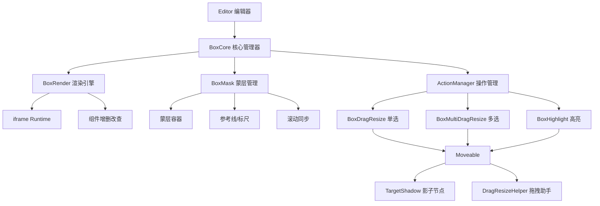

## 核心类详解

### 1. BoxCore - 核心管理器

**职责：** 统一对外接口，管理所有子模块的协调工作

**主要功能：**
- 管理 BoxRender、BoxMask、ActionManager 三个核心模块
- 提供组件选中、高亮、增删改查的统一接口
- 处理画布缩放、参考线设置
- 事件分发和状态管理

```typescript
// 核心接口
class BoxCore {
  public select(idOrEl: Id | HTMLElement, event?: MouseEvent)     // 单选
  public multiSelect(idOrElList: HTMLElement[] | Id[])            // 多选
  public highlight(idOrEl: Id | HTMLElement)                      // 高亮
  public update(data: IUpdateData)                                // 更新组件
  public add(data: IUpdateData)                                   // 添加组件
  public delete(data: IDeleteData)                                // 删除组件
  public setZoom(zoom: number)                                    // 设置缩放
}
```

### 2. BoxRender - 渲染引擎

**职责：** 基于 iframe 加载 runtime，管理组件的渲染和 DOM 操作

**核心特性：**
- **iframe 隔离：** 提供独立的运行环境
- **跨域支持：** 支持同域直接加载和跨域 srcdoc 加载
- **DOM 查询：** 提供 `getElementsFromPoint` 核心 API
- **组件管理：** 增删改查组件的实际执行者

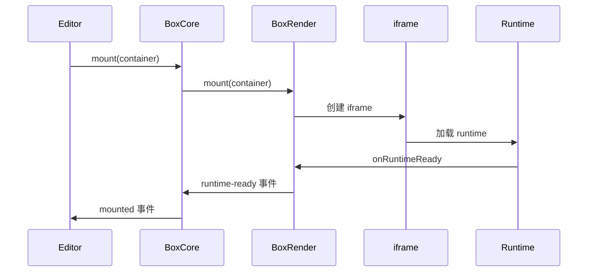

### 3. BoxMask - 蒙层管理

**职责：** 在画布上创建透明蒙层，拦截鼠标事件，管理参考线和滚动

**核心作用：**
- **事件拦截：** 防止组件原生事件被触发
- **交互基础：** 为拖拽、选中提供事件监听基础
- **视觉辅助：** 管理参考线、标尺显示
- **滚动同步：** 与 iframe 内容保持滚动同步

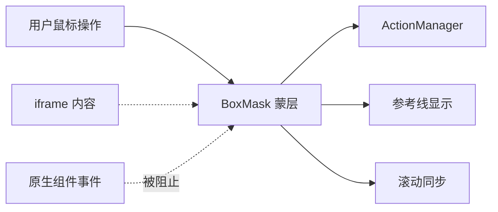

### 4. ActionManager - 操作管理器

**职责：** 监听蒙层事件，管理单选、多选、高亮三种操作模式

**核心逻辑：**
- **事件监听：** 监听蒙层上的鼠标、键盘事件
- **模式切换：** 根据 Ctrl/Cmd 键状态切换单选/多选模式
- **元素查找：** 通过 `getElementsFromPoint` 找到鼠标下的可选元素
- **状态管理：** 管理选中状态、高亮状态的切换

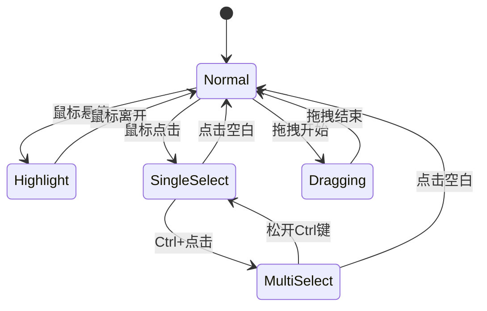

### 5. 拖拽系统

#### BoxDragResize - 单选拖拽

**职责：** 管理单个组件的拖拽、缩放、旋转操作

**核心机制：**
- **影子节点：** 创建与目标组件大小相同的透明 div
- **Moveable 集成：** 使用 Moveable 库实现拖拽功能
- **实时同步：** 拖拽过程中同步更新实际组件位置

#### BoxMultiDragResize - 多选拖拽

**职责：** 管理多个组件的批量拖拽和缩放

**特殊处理：**
- **批量操作：** 同时操作多个组件
- **相对位置：** 保持组件间的相对位置关系
- **父子排除：** 避免父子组件同时被选中时的重复操作

### 6. 辅助系统

#### TargetShadow - 影子节点管理

**职责：** 为目标组件创建蒙层上的占位节点

```typescript
// 影子节点的作用
class TargetShadow {
  public update(target: HTMLElement): HTMLElement    // 更新单个影子节点
  public updateGroup(targets: HTMLElement[])         // 更新多个影子节点
  public destroy()                                   // 销毁影子节点
}
```

#### DragResizeHelper - 拖拽助手

**职责：** 响应 Moveable 事件，同步更新组件和影子节点

**处理模式：**
- **绝对定位：** 直接修改 left、top、width、height
- **流式布局：** 创建 Ghost 元素，通过位置计算实现排序

## 工作流程

### 1. 初始化流程

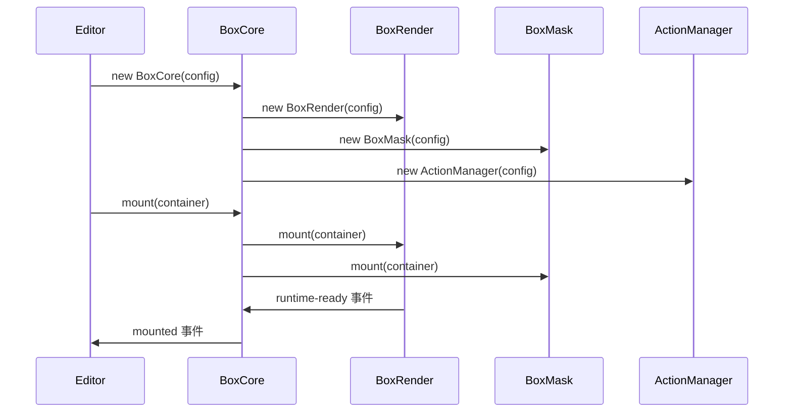

### 2. 组件选中流程

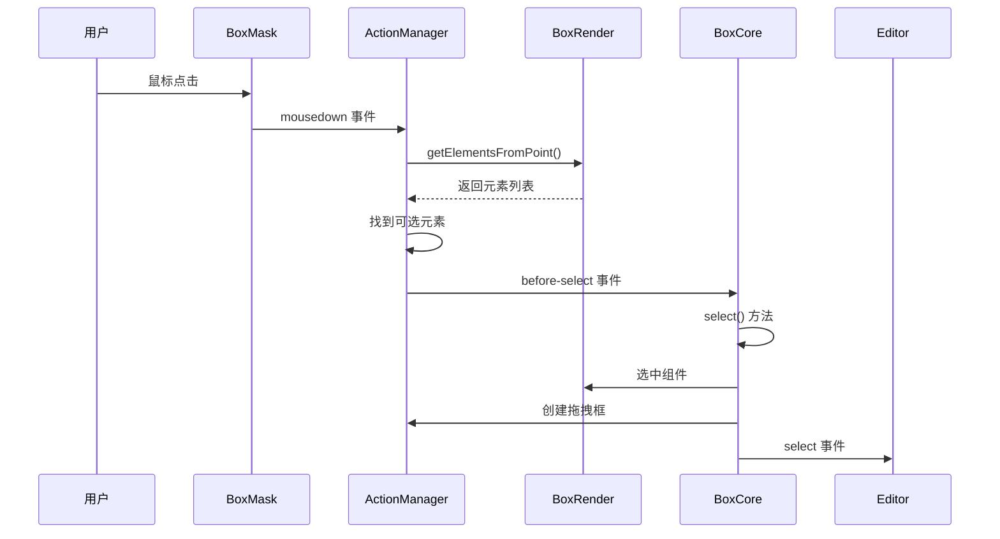

### 3. 组件拖拽流程

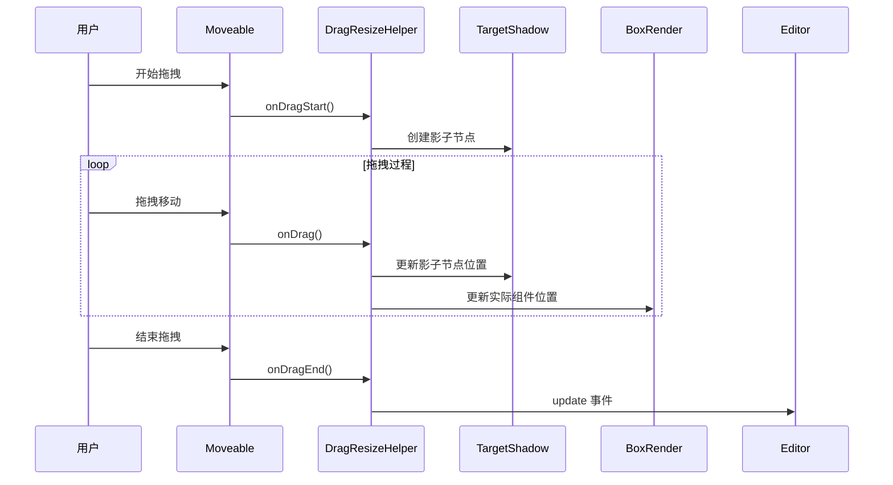

### 4. 组件高亮流程

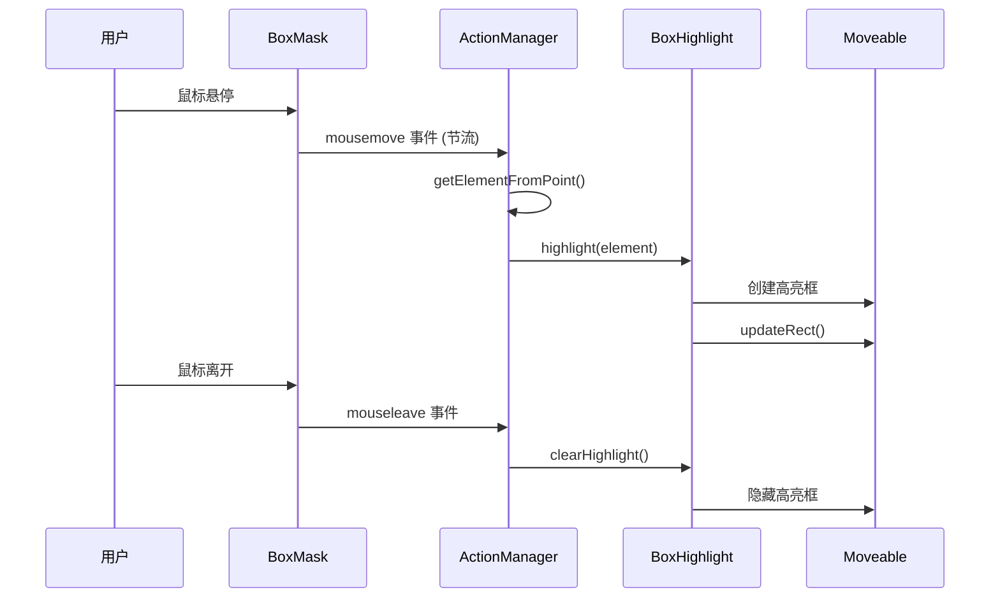

## 关键技术实现

### 1. 事件隔离机制

```typescript
// 蒙层拦截所有鼠标事件
mask.addEventListener('mousedown', this.mouseDownHandler);
mask.addEventListener('mousemove', this.mouseMoveHandler);
mask.addEventListener('mouseleave', this.mouseLeaveHandler);

// 防止 iframe 内组件事件被触发
mask.style.pointerEvents = 'auto';
iframe.style.pointerEvents = 'none'; // 操作时阻止 iframe 事件
```

### 2. 坐标转换系统

```typescript
// 将蒙层坐标转换为 iframe 内坐标
public getElementsFromPoint(point: IPoint): HTMLElement[] {
  let x = point.clientX;
  let y = point.clientY;
  
  if (this.iframe) {
    const rect = this.iframe.getClientRects()[0];
    if (rect) {
      x = x - rect.left;
      y = y - rect.top;
    }
  }
  
  return this.getDocument()?.elementsFromPoint(x / this.zoom, y / this.zoom);
}
```

### 3. 多模式布局支持

```typescript
export enum Mode {
  ABSOLUTE = 'absolute',  // 绝对定位
  FIXED = 'fixed',       // 固定定位  
  SORTABLE = 'sortable', // 流式布局
}

// 根据组件样式确定布局模式
export function getMode(el: Element): Mode {
  if (isFixedParent(el)) return Mode.FIXED;
  const style = getComputedStyle(el);
  if (isStatic(style) || isRelative(style)) return Mode.SORTABLE;
  return Mode.ABSOLUTE;
}
```

### 4. 影子节点同步

```typescript
// 影子节点与实际节点保持同步
public updateEl(target: HTMLElement, src?: HTMLElement): HTMLElement {
  const el = src || document.createElement('div');
  
  // 同步 ID
  el.id = `${this.idPrefix}${target.id}`;
  
  // 同步样式和位置
  el.style.cssText = getTargetElStyle(target, this.zIndex);
  
  // 处理固定定位的特殊情况
  if (isFixed && mode !== Mode.FIXED) {
    el.style.transform = `translate3d(${this.scrollLeft}px, ${this.scrollTop}px, 0)`;
  }
  
  return el;
}
```

## 设计原则

### 1. 分层架构
- **核心层：** BoxCore 提供统一接口
- **渲染层：** BoxRender 处理 iframe 和组件
- **交互层：** BoxMask + ActionManager 处理用户操作
- **操作层：** 拖拽、高亮等具体功能实现

### 2. 事件驱动
- 使用发布订阅模式进行模块间通信
- 所有状态变更通过事件通知
- 支持外部监听和扩展

### 3. 职责分离
- 每个类都有明确的单一职责
- 通过依赖注入实现松耦合
- 支持独立测试和替换

### 4. 性能优化
- 事件节流避免频繁触发
- 影子节点减少 DOM 操作
- 延迟更新减少重排重绘

## 扩展点

### 1. 自定义 Moveable 配置

```typescript
// 支持动态配置 Moveable 参数
moveableOptions: (config) => ({
  draggable: true,
  resizable: true,
  rotatable: config.isMulti ? false : true,
  // ... 更多配置
})
```

### 2. 自定义选择逻辑

```typescript
// 支持业务自定义选择规则
canSelect: async (el, event, stop) => {
  // 自定义选择逻辑
  if (el.classList.contains('locked')) {
    return false;
  }
  return true;
}
```

### 3. 自定义容器判断

```typescript
// 支持自定义容器识别
isContainer: async (el) => {
  return el.classList.contains('droppable-container');
}
```

通过这种灵活的架构设计，Sandbox 模块能够适应各种复杂的可视化编辑需求，为上层编辑器提供强大而稳定的画布能力。

## 事件系统

Sandbox 模块采用了完整的事件驱动架构，通过 DOM 原生事件监听和自定义事件系统实现各个模块间的通信。

### DOM 原生事件监听

#### ActionManager 监听的原生事件

```typescript
// 鼠标交互事件
container.addEventListener('mousedown', this.mouseDownHandler);    // 鼠标按下
container.addEventListener('mousemove', this.mouseMoveHandler);    // 鼠标移动
container.addEventListener('mouseleave', this.mouseLeaveHandler);  // 鼠标离开
container.addEventListener('wheel', this.mouseWheelHandler);       // 鼠标滚轮
container.addEventListener('dblclick', this.dblclickHandler);      // 双击

// 动态添加的事件
document.addEventListener('mouseup', this.mouseUpHandler);         // 鼠标抬起（临时）
```

#### BoxRender 监听的原生事件

```typescript
// iframe 生命周期事件
iframe.addEventListener('load', this.loadHandler);                // iframe 加载完成
```

#### BoxMask 监听的原生事件

```typescript
// 滚动同步事件
content.addEventListener('wheel', this.mouseWheelHandler);         // 滚动事件
```

#### TargetShadow 监听的原生事件

```typescript
// 自定义滚动事件
container.addEventListener('customScroll', this.scrollHandler);   // 自定义滚动同步
```

#### KeyController 监听的全局事件

```typescript
// 键盘状态事件
KeyController.global.on('blur', () => {                          // 键盘失焦
    this.isMultiSelectStatus = false;                            // 重置多选状态
});
```

### 自定义事件系统

#### BoxCore 对外发出的事件

| 事件名 | 参数 | 描述 |
|-------|------|------|
| `mounted` | 无 | 画布挂载完成 |
| `runtime-ready` | `runtime: IRuntime` | 运行时环境就绪 |
| `page-el-update` | `el: HTMLElement` | 页面元素更新 |
| `change-mask` | `data: IGuidesEventData` | 参考线变化 |
| `select` | `selectedEl: HTMLElement, event: MouseEvent` | 单选完成 |
| `multi-select` | `selectedElList: HTMLElement[], event: MouseEvent` | 多选完成 |
| `dblclick` | `event: MouseEvent` | 双击事件 |
| `update` | `data: IUpdateEventData` | 组件更新（位置、大小等） |
| `sort` | `data: IUpdateEventData` | 组件排序 |
| `select-parent` | 无 | 选中父元素 |
| `remove` | `data: IRemoveEventData` | 移除组件 |
| `highlight` | `highlightEl: HTMLElement` | 高亮组件 |
| `mousemove` | `event: MouseEvent` | 鼠标移动 |
| `mouseleave` | `event: MouseEvent` | 鼠标离开 |
| `drag-start` | `e: OnDragStart` | 拖拽开始 |

#### ActionManager 内部事件流

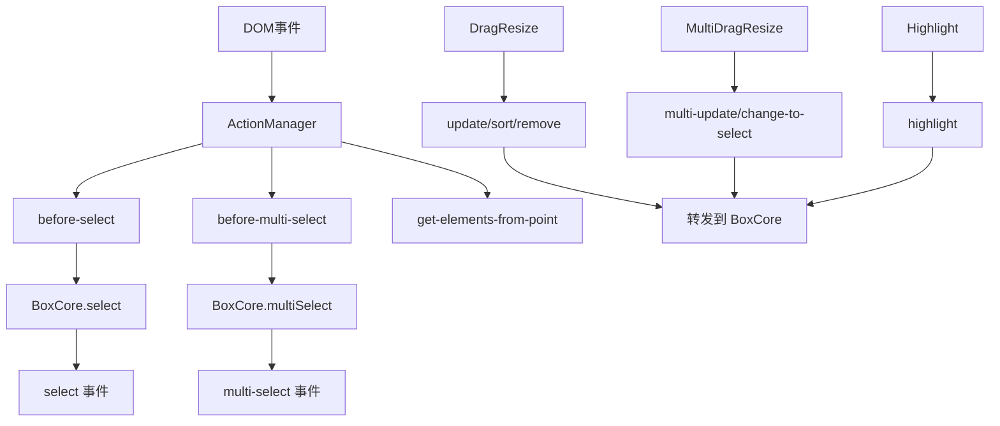

#### 各模块内部事件详解

**ActionManager 发出的事件：**

```typescript
// 选中相关事件
'before-select'        // 选中前置处理，内部使用
'select'              // 单选完成，对外通知
'before-multi-select' // 多选前置处理，内部使用
'multi-select'        // 多选完成，对外通知

// 拖拽相关事件
'update'              // 单选拖拽更新
'sort'                // 单选排序更新
'multi-update'        // 多选拖拽更新
'change-to-select'    // 多选切换到单选

// 操作相关事件
'select-parent'       // 选中父元素
'remove'              // 删除元素
'drag-start'          // 拖拽开始

// 交互相关事件
'highlight'           // 高亮元素
'mousemove'           // 鼠标移动
'mouseleave'          // 鼠标离开
'dblclick'            // 双击

// 调试相关事件
'get-elements-from-point' // 获取鼠标点位元素列表
```

**BoxRender 发出的事件：**

```typescript
'runtime-ready'       // iframe 中的运行时环境准备就绪
'page-el-update'      // 页面根元素更新，触发画布重新观察
'onload'              // iframe 加载完成（内部使用）
```

**BoxMask 发出的事件：**

```typescript
'scroll'              // 滚动事件，用于同步滚动位置
'change-mask'         //参考线变化事件
```

**Rule 发出的事件：**

```typescript
'change-mask'         // 参考线配置变化
// 包含两种类型：
// - type: 'horizontal', guides: number[]  // 水平参考线
// - type: 'vertical', guides: number[]    // 垂直参考线
```

### Moveable 集成事件

#### 单选拖拽事件（BoxDragResize）

```typescript
// 拖拽事件流
.on('dragStart', (e) => {
    // 拖拽开始，创建影子节点
    this.emit('drag-start', e);
})
.on('drag', (e) => {
    // 拖拽过程，实时更新位置
    this.dragResizeHelper.onDrag(e);
})
.on('dragEnd', () => {
    // 拖拽结束，触发更新事件
    // 自动判断是普通更新还是排序更新
});

// 缩放事件流
.on('resizeStart', (e) => {
    // 缩放开始
})
.on('resize', (e) => {
    // 缩放过程，实时更新大小
    this.dragResizeHelper.onResize(e);
})
.on('resizeEnd', () => {
    // 缩放结束
});

// 旋转事件流
.on('rotateStart', (e) => {
    // 旋转开始
})
.on('rotate', (e) => {
    // 旋转过程
    this.dragResizeHelper.onRotate(e);
})
.on('rotateEnd', (e) => {
    // 旋转结束
});
```

#### 多选拖拽事件（BoxMultiDragResize）

```typescript
// 多选拖拽事件流
.on('dragGroupStart', (e) => {
    // 多选拖拽开始
})
.on('dragGroup', (e) => {
    // 多选拖拽过程
    this.dragResizeHelper.onDragGroup(e);
})
.on('dragGroupEnd', () => {
    // 多选拖拽结束
});

// 多选缩放事件流
.on('resizeGroupStart', (e) => {
    // 多选缩放开始
})
.on('resizeGroup', (e) => {
    // 多选缩放过程
    this.dragResizeHelper.onResizeGroup(e);
})
.on('resizeGroupEnd', () => {
    // 多选缩放结束
});

// 多选点击事件
.on('clickGroup', (e) => {
    // 多选状态下点击某个元素，切换为单选
    this.emit('change-to-select', id, e.inputEvent);
});
```

### 事件数据结构

#### IUpdateEventData - 更新事件数据

```typescript
interface IUpdateEventData {
    data: {
        el: HTMLElement;        // 被更新的元素
        style: {
            width?: number;     // 宽度变化
            height?: number;    // 高度变化
            left?: number;      // 水平位置变化
            top?: number;       // 垂直位置变化
            transform?: {
                rotate?: string; // 旋转角度
                scale?: string;  // 缩放比例
            };
        };
        ghostEl?: HTMLElement;  // 流式布局的占位元素
    }[];
    parentEl: HTMLElement | null; // 父容器元素
}
```

#### IRemoveEventData - 删除事件数据

```typescript
interface IRemoveEventData {
    data: {
        el: HTMLElement;        // 被删除的元素
    }[];
}
```

#### IGuidesEventData - 参考线事件数据

```typescript
interface IGuidesEventData {
    type: 'horizontal' | 'vertical'; // 参考线类型
    guides: number[];                // 参考线位置数组
}
```

### 事件流程时序

#### 完整的选中操作事件流程

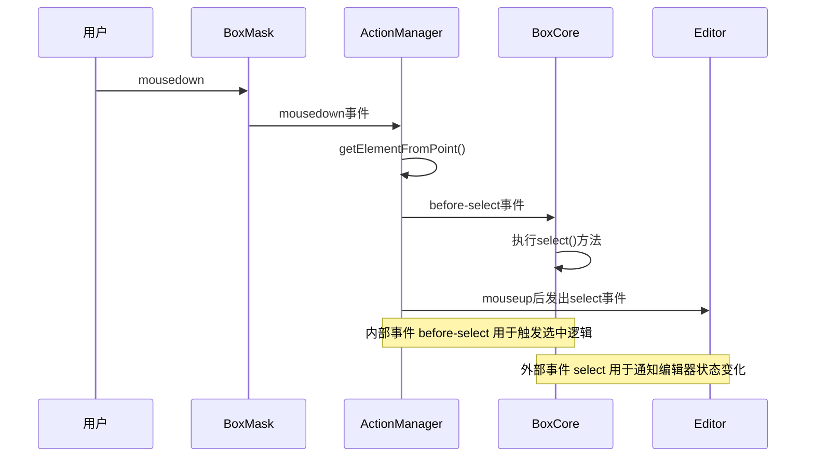

#### 完整的拖拽操作事件流程

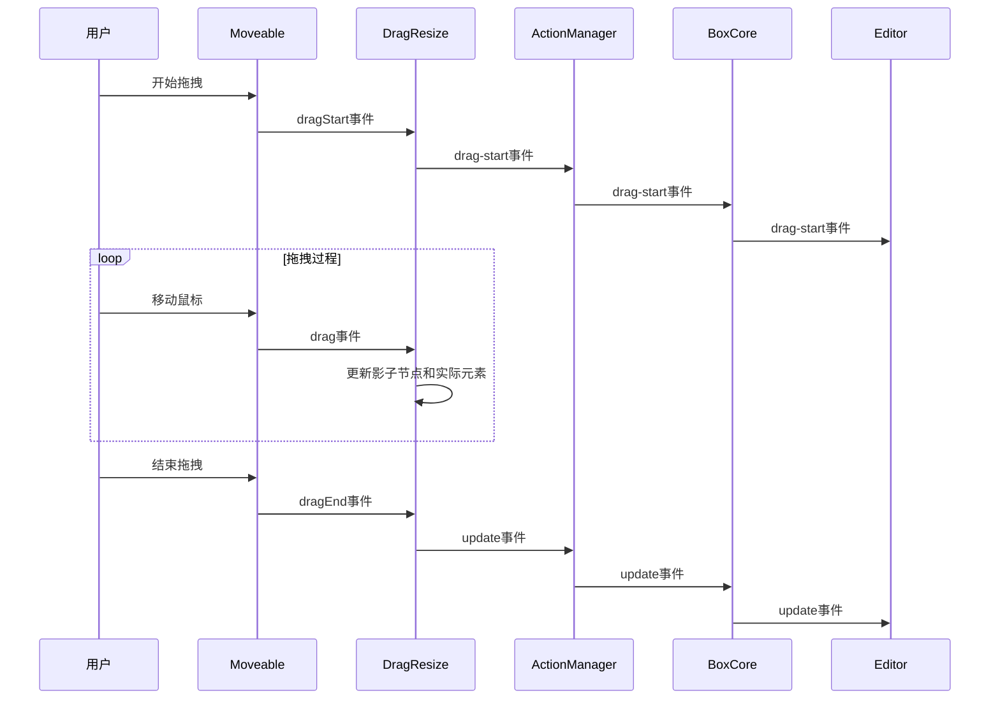

### 事件性能优化

#### 事件节流

```typescript
// 鼠标移动事件节流，避免频繁触发高亮
js_utils_throttle_event(
    async (event: MouseEvent): Promise<void> => {
        const el = await this.getElementFromPoint(event);
        if (!el) {
            this.clearHighlight();
            return;
        }
        this.highlight(el);
    },
    { time: throttleTime, context: this, args: [event] }
);
```

#### 延迟事件发出

```typescript
// 延迟发出update事件，确保select事件先被处理
dr.on('update', (data: IUpdateEventData) => {
    setTimeout(() => this.emit('update', data));
});
```

通过这套完整的事件系统，Sandbox 模块实现了高效的模块间通信和状态同步管理。

## 观察器系统

Sandbox 模块使用了多种浏览器原生观察器 API 来监听 DOM 变化，实现自动的布局更新和视觉反馈。这些观察器确保了画布在各种尺寸变化和滚动操作下都能保持正确的显示状态。

### 观察器架构图

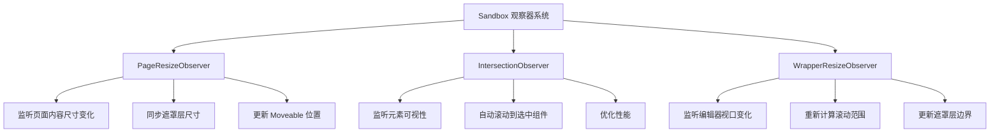

### 1. PageResizeObserver - 页面尺寸监听

**所属模块：** BoxCore  
**监听目标：** iframe 内的页面根元素  
**作用：** 当页面内容尺寸发生变化时，同步更新遮罩层和操作元素

#### 实现机制

```typescript
// BoxCore 中的页面尺寸监听器
private pageResizeObserver: ResizeObserver | null = null;

/**
 * 监听页面大小变化, 同步更改mask与actionmanage
 * @param page 页面元素
 */
private observePageResize(page: HTMLElement): void {
    // 清理旧的监听器
    if (this.pageResizeObserver) {
        this.pageResizeObserver.disconnect();
    }

    // 创建新的尺寸变化监听器
    if (typeof ResizeObserver !== 'undefined') {
        this.pageResizeObserver = new ResizeObserver((entries) => {
            console.log('observePageResize');
            // 通知遮罩层页面尺寸变化
            this.mask.pageResize(entries);
            // 更新操作管理器的moveable位置
            this.actionManager.updateMoveable();
        });

        this.pageResizeObserver.observe(page);
    }
}
```

#### 触发时机

- 页面初始化完成时 (`page-el-update` 事件)
- 组件增删改操作导致页面尺寸变化时
- 运行时动态修改页面内容时

#### 回调处理

```typescript
// 页面尺寸变化的回调处理
pageResizeObserver.callback = (entries) => {
    // 1. 更新遮罩层尺寸，保持与页面同步
    this.mask.pageResize(entries);
    
    // 2. 更新 Moveable 组件位置，确保拖拽框准确
    this.actionManager.updateMoveable();
}
```

### 2. IntersectionObserver - 元素可视性监听

**所属模块：** BoxMask  
**监听目标：** 被选中的组件元素  
**作用：** 检测选中元素是否在可视区域内，自动滚动使其可见

#### 实现机制

```typescript
// BoxMask 中的交叉观察器
private intersectionObserver: IntersectionObserver | null = null;

/**
 * 监听选中元素是否在画布可视区域内
 */
private initObserverIntersection() {
    // 获取页面的滚动父容器
    this.pageScrollParent = getScrollParent(this.page as HTMLElement) || null;
    
    // 断开之前的观察器
    this.intersectionObserver?.disconnect();

    if (typeof IntersectionObserver !== 'undefined') {
        this.intersectionObserver = new IntersectionObserver(
            (entries) => {
                entries.forEach((entry) => {
                    const { target, intersectionRatio } = entry;
                    // 如果元素完全不可见，则滚动到该元素
                    if (intersectionRatio <= 0) {
                        this.scrollIntoView(target);
                    }
                    // 停止观察该元素（一次性操作）
                    this.intersectionObserver?.unobserve(target);
                });
            },
            {
                root: this.pageScrollParent,      // 观察根为滚动容器
                rootMargin: '0px',               // 无边距扩展
                threshold: 1.0                   // 完全可见时触发
            }
        );
    }
}
```

#### 使用场景

1. **左侧组件树选中：** 当从组件树中选中某个组件时
2. **程序化选中：** 通过 API 选中不在可视区域的组件时
3. **深层嵌套组件：** 选中页面底部或嵌套较深的组件时

#### 调用方式

```typescript
// 公开的观察方法
public observerIntersection(el: HTMLElement): void {
    this.intersectionObserver?.observe(el);
}

// BoxCore 中的调用
// 单选时自动滚动到选中元素
this.mask.observerIntersection(el);

// 多选时滚动到最后一个选中元素
if (lastEl) {
    this.mask.observerIntersection(lastEl);
}
```

### 3. WrapperResizeObserver - 视口尺寸监听

**所属模块：** BoxMask  
**监听目标：** 遮罩层的包装容器（编辑器视口）  
**作用：** 当编辑器视口大小改变时，重新计算滚动范围和遮罩边界

#### 实现机制

```typescript
// BoxMask 中的包装器尺寸观察器
private wrapperResizeObserver: ResizeObserver | null = null;

/**
 * 监听mask的容器大小变化
 */
private initObserverWrapper(): void {
    // 断开之前的观察器
    this.wrapperResizeObserver?.disconnect();

    if (typeof ResizeObserver !== 'undefined') {
        this.wrapperResizeObserver = new ResizeObserver((entries) => {
            if (!entries || entries.length === 0) return;

            const [entry] = entries;
            const { clientHeight, clientWidth } = entry!.target;

            // 更新包装器尺寸记录
            this.wrapperHeight = clientHeight;
            this.wrapperWidth = clientWidth;

            // 重新计算最大滚动距离
            this.setMaxScrollLeft();
            this.setMaxScrollTop();
        });
        
        // 观察包装器元素的尺寸变化
        this.wrapperResizeObserver.observe(this.wrapper);
    }
}
```

#### 触发场景

- **浏览器窗口缩放：** 用户调整浏览器窗口大小
- **编辑器布局变化：** 侧边栏收起/展开，面板大小调整
- **响应式布局：** 不同设备尺寸下的布局适配
- **全屏模式切换：** 进入/退出全屏编辑模式

#### 更新内容

```typescript
// 尺寸变化后的更新操作
wrapperResizeObserver.callback = (entries) => {
    const { clientHeight, clientWidth } = entry.target;
    
    // 1. 更新视口尺寸记录
    this.wrapperHeight = clientHeight;
    this.wrapperWidth = clientWidth;
    
    // 2. 重新计算滚动边界
    this.setMaxScrollLeft();  // 最大水平滚动距离
    this.setMaxScrollTop();   // 最大垂直滚动距离
}
```

### 观察器生命周期管理

#### 初始化时机

```typescript
// 1. BoxCore 初始化页面观察器
renderer.on('page-el-update', (el: HTMLElement) => {
    this.mask?.observe(el);           // 初始化遮罩观察器
    this.observePageResize(el);       // 初始化页面观察器
});

// 2. BoxMask 初始化视口和交叉观察器
public observe(page: HTMLElement): void {
    this.page = page;
    this.initObserverIntersection();  // 初始化交叉观察器
    this.initObserverWrapper();       // 初始化视口观察器
}
```

#### 清理和销毁

```typescript
// BoxCore 销毁时清理页面观察器
public destory() {
    this.pageResizeObserver?.disconnect();
    this.pageResizeObserver = null;
}

// BoxMask 销毁时清理所有观察器
public destory() {
    this.wrapperResizeObserver?.disconnect();
    this.intersectionObserver?.disconnect();
    this.wrapperResizeObserver = null;
    this.intersectionObserver = null;
}
```

### 观察器性能优化

#### 1. 懒加载和条件创建

```typescript
// 只在支持的浏览器中创建观察器
if (typeof ResizeObserver !== 'undefined') {
    this.pageResizeObserver = new ResizeObserver(callback);
}

if (typeof IntersectionObserver !== 'undefined') {
    this.intersectionObserver = new IntersectionObserver(callback, options);
}
```

#### 2. 及时断开不需要的观察

```typescript
// 交叉观察器：一次性操作，观察完成后立即断开
entries.forEach((entry) => {
    if (intersectionRatio <= 0) {
        this.scrollIntoView(target);
    }
    // 避免重复观察，节省性能
    this.intersectionObserver?.unobserve(target);
});
```

#### 3. 防抖和节流

```typescript
// 页面尺寸变化可能很频繁，通过 console.log 可以观察触发频率
this.pageResizeObserver = new ResizeObserver((entries) => {
    console.log('observePageResize'); // 用于调试观察触发频率
    this.mask.pageResize(entries);
    this.actionManager.updateMoveable();
});
```

### 观察器协作流程

#### 完整的尺寸同步流程

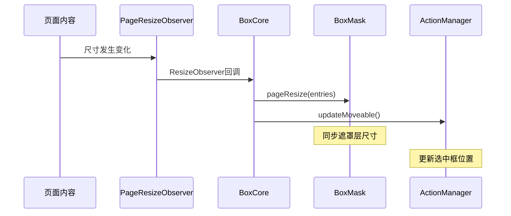

#### 选中元素自动滚动流程

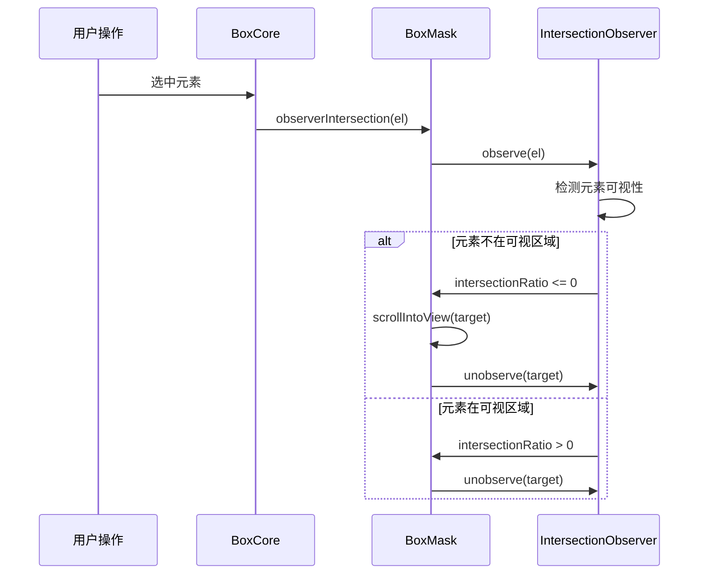

通过这套完整的观察器系统，Sandbox 模块能够自动响应各种布局变化，确保用户在任何情况下都能获得准确、流畅的编辑体验。
