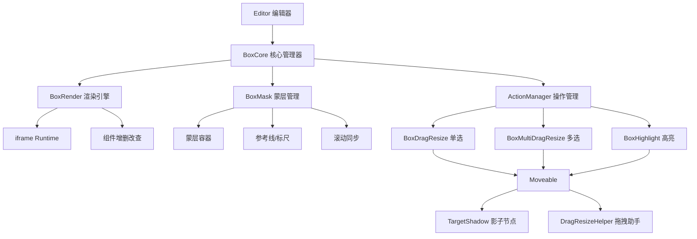
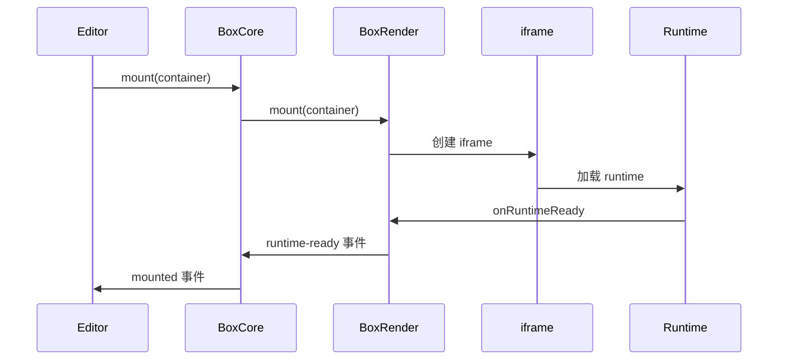
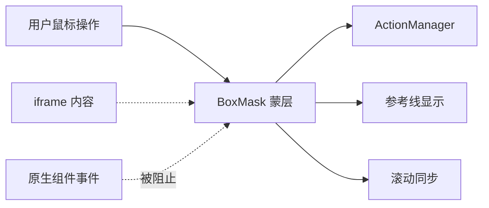
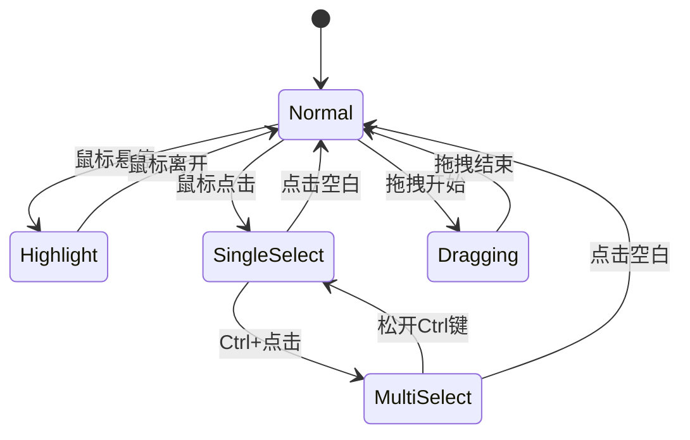
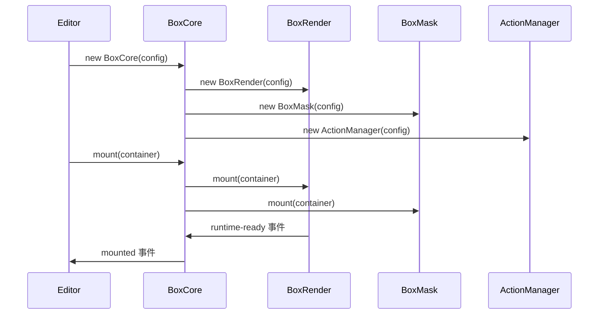
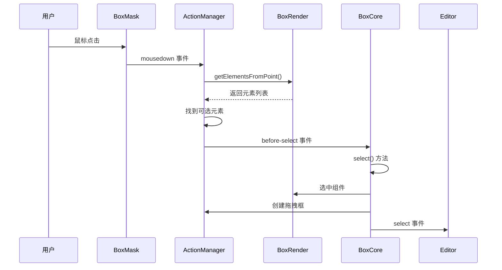
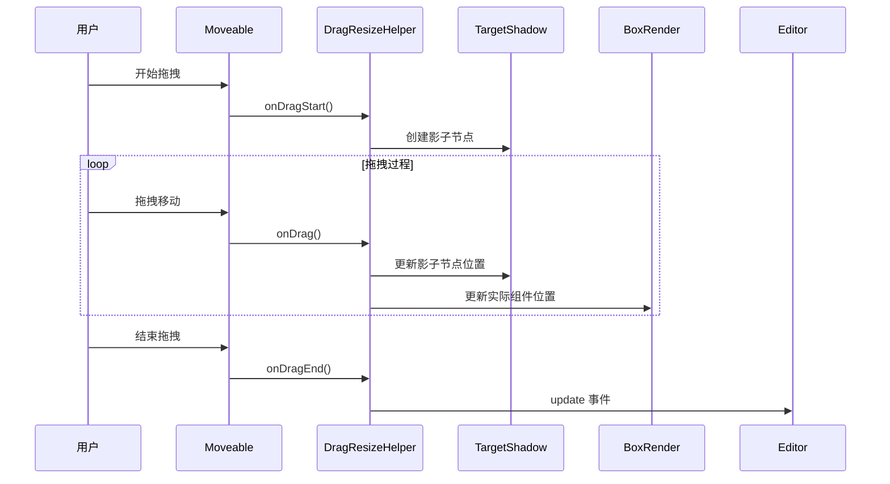
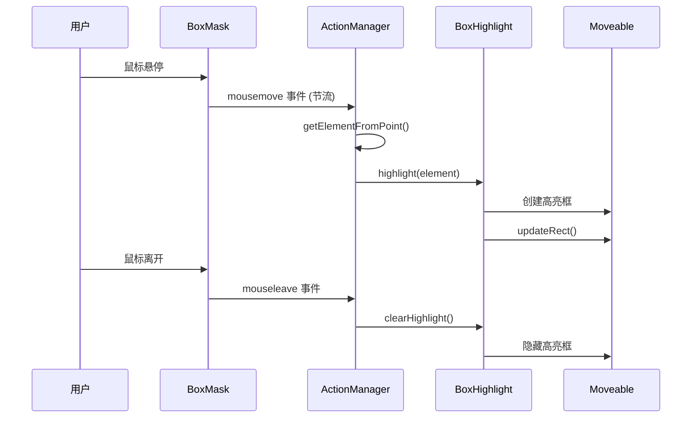

# Sandbox 画布模块

## 概述

Sandbox 是 Quantum Low-Code 平台的核心画布模块，负责在可视化编辑器中渲染和管理组件，提供拖拽、选中、高亮、缩放等交互功能。它基于 iframe 技术构建了一个隔离的运行环境，同时通过蒙层技术实现精确的交互控制。

## 核心架构

### 主要组成部分

1. **BoxCore** - 核心管理器
2. **BoxRender** - 渲染引擎
3. **BoxMask** - 蒙层管理
4. **ActionManager** - 操作管理器
5. **拖拽系统** - 单选/多选拖拽
6. **高亮系统** - 组件高亮显示



## 核心类详解

### 1. BoxCore - 核心管理器

**职责：** 统一对外接口，管理所有子模块的协调工作

**主要功能：**
- 管理 BoxRender、BoxMask、ActionManager 三个核心模块
- 提供组件选中、高亮、增删改查的统一接口
- 处理画布缩放、参考线设置
- 事件分发和状态管理

```typescript
// 核心接口
class BoxCore {
  public select(idOrEl: Id | HTMLElement, event?: MouseEvent)     // 单选
  public multiSelect(idOrElList: HTMLElement[] | Id[])            // 多选
  public highlight(idOrEl: Id | HTMLElement)                      // 高亮
  public update(data: IUpdateData)                                // 更新组件
  public add(data: IUpdateData)                                   // 添加组件
  public delete(data: IDeleteData)                                // 删除组件
  public setZoom(zoom: number)                                    // 设置缩放
}
```

### 2. BoxRender - 渲染引擎

**职责：** 基于 iframe 加载 runtime，管理组件的渲染和 DOM 操作

**核心特性：**
- **iframe 隔离：** 提供独立的运行环境
- **跨域支持：** 支持同域直接加载和跨域 srcdoc 加载
- **DOM 查询：** 提供 `getElementsFromPoint` 核心 API
- **组件管理：** 增删改查组件的实际执行者



### 3. BoxMask - 蒙层管理

**职责：** 在画布上创建透明蒙层，拦截鼠标事件，管理参考线和滚动

**核心作用：**
- **事件拦截：** 防止组件原生事件被触发
- **交互基础：** 为拖拽、选中提供事件监听基础
- **视觉辅助：** 管理参考线、标尺显示
- **滚动同步：** 与 iframe 内容保持滚动同步



### 4. ActionManager - 操作管理器

**职责：** 监听蒙层事件，管理单选、多选、高亮三种操作模式

**核心逻辑：**
- **事件监听：** 监听蒙层上的鼠标、键盘事件
- **模式切换：** 根据 Ctrl/Cmd 键状态切换单选/多选模式
- **元素查找：** 通过 `getElementsFromPoint` 找到鼠标下的可选元素
- **状态管理：** 管理选中状态、高亮状态的切换



### 5. 拖拽系统

#### BoxDragResize - 单选拖拽

**职责：** 管理单个组件的拖拽、缩放、旋转操作

**核心机制：**
- **影子节点：** 创建与目标组件大小相同的透明 div
- **Moveable 集成：** 使用 Moveable 库实现拖拽功能
- **实时同步：** 拖拽过程中同步更新实际组件位置

#### BoxMultiDragResize - 多选拖拽

**职责：** 管理多个组件的批量拖拽和缩放

**特殊处理：**
- **批量操作：** 同时操作多个组件
- **相对位置：** 保持组件间的相对位置关系
- **父子排除：** 避免父子组件同时被选中时的重复操作

### 6. 辅助系统

#### TargetShadow - 影子节点管理

**职责：** 为目标组件创建蒙层上的占位节点

```typescript
// 影子节点的作用
class TargetShadow {
  public update(target: HTMLElement): HTMLElement    // 更新单个影子节点
  public updateGroup(targets: HTMLElement[])         // 更新多个影子节点
  public destroy()                                   // 销毁影子节点
}
```

#### DragResizeHelper - 拖拽助手

**职责：** 响应 Moveable 事件，同步更新组件和影子节点

**处理模式：**
- **绝对定位：** 直接修改 left、top、width、height
- **流式布局：** 创建 Ghost 元素，通过位置计算实现排序

## 工作流程

### 1. 初始化流程



### 2. 组件选中流程



### 3. 组件拖拽流程



### 4. 组件高亮流程



## 关键技术实现

### 1. 事件隔离机制

```typescript
// 蒙层拦截所有鼠标事件
mask.addEventListener('mousedown', this.mouseDownHandler);
mask.addEventListener('mousemove', this.mouseMoveHandler);
mask.addEventListener('mouseleave', this.mouseLeaveHandler);

// 防止 iframe 内组件事件被触发
mask.style.pointerEvents = 'auto';
iframe.style.pointerEvents = 'none'; // 操作时阻止 iframe 事件
```

### 2. 坐标转换系统

```typescript
// 将蒙层坐标转换为 iframe 内坐标
public getElementsFromPoint(point: IPoint): HTMLElement[] {
  let x = point.clientX;
  let y = point.clientY;
  
  if (this.iframe) {
    const rect = this.iframe.getClientRects()[0];
    if (rect) {
      x = x - rect.left;
      y = y - rect.top;
    }
  }
  
  return this.getDocument()?.elementsFromPoint(x / this.zoom, y / this.zoom);
}
```

### 3. 多模式布局支持

```typescript
export enum Mode {
  ABSOLUTE = 'absolute',  // 绝对定位
  FIXED = 'fixed',       // 固定定位  
  SORTABLE = 'sortable', // 流式布局
}

// 根据组件样式确定布局模式
export function getMode(el: Element): Mode {
  if (isFixedParent(el)) return Mode.FIXED;
  const style = getComputedStyle(el);
  if (isStatic(style) || isRelative(style)) return Mode.SORTABLE;
  return Mode.ABSOLUTE;
}
```

### 4. 影子节点同步

```typescript
// 影子节点与实际节点保持同步
public updateEl(target: HTMLElement, src?: HTMLElement): HTMLElement {
  const el = src || document.createElement('div');
  
  // 同步 ID
  el.id = `${this.idPrefix}${target.id}`;
  
  // 同步样式和位置
  el.style.cssText = getTargetElStyle(target, this.zIndex);
  
  // 处理固定定位的特殊情况
  if (isFixed && mode !== Mode.FIXED) {
    el.style.transform = `translate3d(${this.scrollLeft}px, ${this.scrollTop}px, 0)`;
  }
  
  return el;
}
```

## 设计原则

### 1. 分层架构
- **核心层：** BoxCore 提供统一接口
- **渲染层：** BoxRender 处理 iframe 和组件
- **交互层：** BoxMask + ActionManager 处理用户操作
- **操作层：** 拖拽、高亮等具体功能实现

### 2. 事件驱动
- 使用发布订阅模式进行模块间通信
- 所有状态变更通过事件通知
- 支持外部监听和扩展

### 3. 职责分离
- 每个类都有明确的单一职责
- 通过依赖注入实现松耦合
- 支持独立测试和替换

### 4. 性能优化
- 事件节流避免频繁触发
- 影子节点减少 DOM 操作
- 延迟更新减少重排重绘

## 扩展点

### 1. 自定义 Moveable 配置

```typescript
// 支持动态配置 Moveable 参数
moveableOptions: (config) => ({
  draggable: true,
  resizable: true,
  rotatable: config.isMulti ? false : true,
  // ... 更多配置
})
```

### 2. 自定义选择逻辑

```typescript
// 支持业务自定义选择规则
canSelect: async (el, event, stop) => {
  // 自定义选择逻辑
  if (el.classList.contains('locked')) {
    return false;
  }
  return true;
}
```

### 3. 自定义容器判断

```typescript
// 支持自定义容器识别
isContainer: async (el) => {
  return el.classList.contains('droppable-container');
}
```

通过这种灵活的架构设计，Sandbox 模块能够适应各种复杂的可视化编辑需求，为上层编辑器提供强大而稳定的画布能力。
